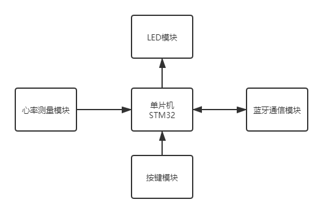

# 第〇章 项目背景与实现思路

随着物联网时代的到来，智能可穿戴设备已经融入到我们生活的方方面面。正是物联网技术的发展，给智能可穿戴医疗设奠定了技术基础。

## 项目背景

## 功能描述

**基本需求：**

1. 脉搏计算，每秒更新一次
2. 脉搏曲线显示

**扩展功能：**

1. 按键长按开机，再次长按关机
2. 正常工作中，LED灯状态随脉搏呈呼吸灯状态闪烁
3. 脉搏异常时自动报警，LED灯闪烁
4. 日志打印
5. 设置用户名
6. 如有LCD，在屏幕上显示：脉搏、用户信息、[波形]、时间等内容

## 实现思路

项目设计分为两个部分：硬件和软件。其中硬件部分有两种解决方案：方案1：MCU+无线通信模块+传感器，方案2：无线通信模块+传感器。后者把数据采集与处理和数据通信同时放在了无线通信模块上，适用于投产产品设计。前者采用独立的无线通信模块，MCU负责数据采集和处理过程，此方案更适用于方案验证，可屏蔽复杂的无线通信部分，快速构建产品原型。

在项目的当前阶段计划采用方案1，通信模块可采用蓝牙透传模块，其通过UART与单片机通信，另外传感器魔法也选用现有模块进行原型搭建与验证。所以系统的硬件框图如下：

软件设计上可简单拆分为几个部分：

* 串口通信部分
* 传感器数据采集部分
* 脉搏检测算法实现部分
* 人机交互部分
    * 按键检测部分
    * 按键处理部分
    * LED控制部分
