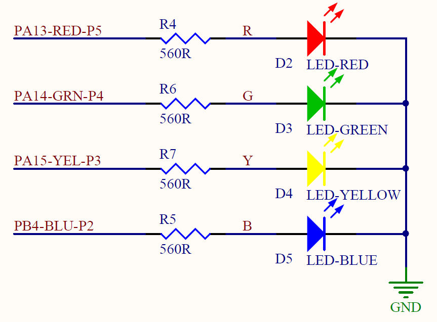
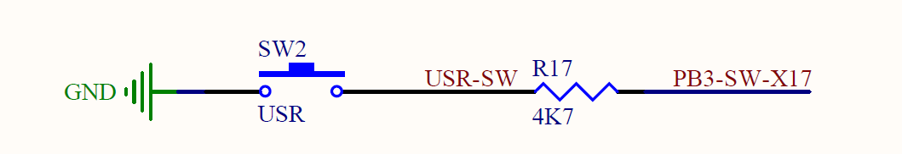
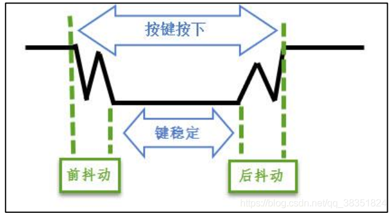
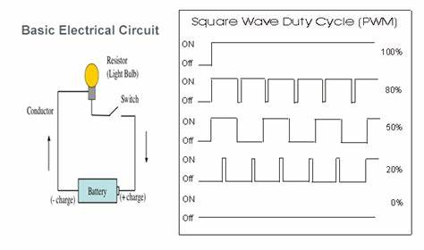

# 人机交互-LED与按键

人机交互是产品设计中非常重要的一个部分，直接决定了用户体验的效果。人机交互中包括2个部分：输入、输出。输入就像计算机的键盘，输出就像是计算机的显示器。

本章节重点研究LED与按键的使用，其他功能参考：

* 人机交互-电容触摸按键
* 人机交互-数码管显示
* 人机交互-LCD显示
* 人机交互-UI界面

研究内容围绕如下需求展开

**LED输出**
其中的LED是最简单的输出设备，移动设备如手机中的充电指示灯就是一个典型的用例，另外医院心电监护仪上的报警灯是3色LED报警的用例。在本项目中LED的主要作用有：

* LED1 表征设备的工作状态：亮开机，灭关机
* LED2 报警灯：脉搏过低/过高时闪烁报警
* LED3 脉搏呼吸灯：随着脉搏逐渐亮灭

**按键输入**
最简单的输入类外设就是按键了，按键是用户与设备交互的最简单的接口。通过按键控制设备状态等，完成人机交互，在本项目中按键主要作用有：

* 开关机按键：长按开机，再次长按关机，短按选择/设置
* 静音按钮：设备报警时一般为声光报警，当按下静音按钮后暂停声音报警，再次按下使能声音报警。
* 查看按钮：包含向上，向下两个按钮，用于翻看屏幕界面/数码管显示内容，同时用于设定报警阈值

## 内容设计

以上可以看出，完整的人机交互是比较复杂的。我们通过一些简单的例子来进行逐步学习。本章节课程将按以下实例开展：

* **点亮1盏灯，并延时闪烁**
* **翻转：点亮4盏灯**
* **1个按键控制1盏灯，实现开关机状态显示功能，与房间中开关控制灯的动作一致**
* **翻转：2个开关控制同一盏灯**
* **1个按键控制4盏灯，1，2，3，4 依次点亮，然后4，3，2，1依次熄灭**
* **翻转：4个灯亮灭表示十六进制数，完成按键计数器**
* **拓展案例：4个LED，4个按键实现4路抢答器**
* **LED亮度控制-延时实现PWM控制**
* ~~**LED亮度控制-定时器实现PWM控制**~~
* **翻转：LED呼吸灯实现**
* **按键按下速度控制LED亮度，停止后LED逐渐熄灭**
* **翻转：双人对战，2个按键控制4个LED的亮度，速度快的一方，使得亮度最高的灯逐渐向对方移动**

---

让我们以开关机功能为例来研究缩LED和按键的用法。为了实现按键控制开关机的功能，我们先设计按键与电源状态灯之间的逻辑关系，设备并非真的关机。实现过程先完成LED的控制，然后逐步加入按键控制LED，最后再完善KEY实现长按与短按功能。

## 第一步：点亮LED

LED与传统灯泡在加电后都能发光，不同的是LED具有方向性，只有方向正确时才能发光，并且传统的灯泡等效为电阻，而LED是二极管，所以需要增加限流电阻防止烧毁LED。
根据下图LED部分电路原理图可以看出，为了使LED点亮需要在单片机的`PA13`口输出高电平，图中R4-7为限流电阻。



在开发环境中以现有的ioc文件创建工程：File-New-> STM32 Project From...->Browse 弹窗中找到ioc文件，选择合适的项目文件并选择C语言开发选项。单击`Finish`即可完成工程创建。

注意：需要提前下载`STM32CubeIDE`，并创建基于`STM32F405`的工程，目的是下载需要的库文件，如HAL库等。如果使用其他系列处理器则需要分别创建工程。

在`main.h`文件中的第61行可以看到如下代码：

```c
// main.h line61
#define LED_RED_Pin GPIO_PIN_13
#define LED_RED_GPIO_Port GPIOA
#define LED_GRN_Pin GPIO_PIN_14
#define LED_GRN_GPIO_Port GPIOA
#define LED_YEL_Pin GPIO_PIN_15
#define LED_YEL_GPIO_Port GPIOA
```

这里定义了3个LED，分别接在单片机的PA13,PA14,PA15引脚。根据原理图可以看出需要把IO口配置为高电平，LED才能被正常点亮。在main.c文件，100行位置找到`while(1)`语句，在此语句前面增加代码：

```c
HAL_GPIO_WritePin(LED_RED_GPIO_Port, LED_RED_Pin, GPIO_PIN_SET);
```

### 翻转：点亮4个LED

学生自行实现同时点亮4个LED。

### 延时函数

与C语言一样，延时函数通过循环执行一定次数的空语句产生运行周期。空语句可以用`;`表示，采用空语句是机器周期短，测算时间更准确。错略的算法是：机器周期x执行次数。例如DEMO中的时钟频率是168MHz，那么延时1ms的话需要执行空语句168000次。

所以可实现定时函数：

```c
void delay_ms(uint16_t ms)
{
    uint32 cnt = 168000;

    while(ms --)
    {
        cnt = 168000;
        while(cnt --);
    }
}
```

### 第二步：利用延时函数实现LED闪烁

LED的闪烁只需要定时改变LED亮灭即可。所以只需要在`while(1)`中增加语句：

```c
  while (1)
  {
    /* USER CODE END WHILE */

    /* USER CODE BEGIN 3 */
    demay_ms(1000);                                     // 延时1s
    HAL_GPIO_TogglePin(LED_RED_GPIO_Port, LED_RED_Pin); // 切换LED亮灭
  }
  /* USER CODE END 3 */
```

注意：用户代码需要写在`BEGIN`和`END`之间。

此部分函数可封装为子函数形式调用，方便增加功能时引起冲突。使用子函数可选择性调用实现不同功能。

### 翻转：流水灯-实现3个LED循环闪烁

LED1,2,3逐个点亮，LED1,2,3逐个熄灭

* 亮 - 灭 - 灭 - 灭
* 亮 - 亮 - 灭 - 灭
* 亮 - 亮 - 亮 - 灭
* 亮 - 亮 - 亮 - 亮
* 亮 - 亮 - 亮 - 灭
* 亮 - 亮 - 灭 - 灭
* 亮 - 灭 - 灭 - 灭
* 亮 - 亮 - 灭 - 灭
* ....

### 翻转：报警灯闪烁

报警灯闪烁需控制LED灭1秒，亮0.5秒表示报警。

## 第三步：按键控制LED亮灭(开关机状态指示)

按键的输入来自单片机的PB3引脚，在LED_DEMO.ioc文件中已经包含了此管脚的配置，所以在`main.h`文件中可以看到如下宏定义：

```c
//main.h line 67
#define USR_KEY_Pin GPIO_PIN_3
#define USR_KEY_GPIO_Port GPIOB
```

对应原理图：



### 3.1 按键捕捉

按键的捕捉有几种：按键被按下，按键按下瞬间，按键释放瞬间。后面两种也叫做按键的**下降沿**和**上升沿**。按下的同时还有按下时长的计算。设备的开关机一般是以按键长按2-3秒来触发的。为了实现此功能，我们从对按键状态的识别到边沿的识别，最后到按键时长的识别来逐步深入研究。

### 3.2 控制LED亮灭-按键按下灯亮，释放灯灭

此需求实际上需要判断的是按键是否被按下，因此可直接读取GPIO口的状态即可。对应函数为：

```c
uint8_t key_scan(void)
{
    if (HAL_GPIO_ReadPin(USR_KEY_GPIO_Port, USR_KEY_Pin))
        return 0;
    else
        return 1;
}
```

然后根据按键状态控制LED的状态，相关代码封装为函数`key_ctrl_led`：

```c
void key_ctrl_led(void) {
    if (key_scan() == 1)
    {
        HAL_GPIO_WritePin(LED_RED_GPIO_Port, LED_RED_Pin, GPIO_PIN_SET);
    }else
    {
        HAL_GPIO_WritePin(LED_RED_GPIO_Port, LED_RED_Pin, GPIO_PIN_RESET);
    }
}
```

然后在while(1)中直接调用`key_ctrl_led`即可。

### 3.3 按键边沿检测

按键的边沿变化需要记录相邻2次按键检测结果，如果不同说明按键状态发生变化。那么`key_scan`函数需修改为：

```c
// 下降沿捕捉
uint8_t key_scan(void)
{
    static uint8_t last_key_state = 1;
    uint8_t key_state;
    uint8_t ret = 0; // unactive

    key_state = (uint8_t)HAL_GPIO_ReadPin(USR_KEY_GPIO_Port, USR_KEY_Pin);

    if(key_state != last_key_state)
    {
        last_key_state = key_state;
        if(key_state == 0) // falling Edge
            ret = 1; // active
    }

    return ret;
}
```

### 3.4 控制LED亮灭-按1下按键，LED翻转

只需要检测按键的下降沿即可，检测到下降沿时改变LED的状态。

```c
void key_ctrl_led(void) {
    if (key_scan() == 1)
        HAL_GPIO_TogglePin(LED_RED_GPIO_Port, LED_RED_Pin); // 切换LED亮灭
}
```

### 翻转：按键上升沿捕捉，并控制LED翻转

修改key_scan函数实现，重命名为`key_rising_scan`。

### 翻转：2个按键控制同一盏灯

检测2个按键的结果，任意按键按下就翻转LED状态。

### 发现问题：按键有时不灵

引入防抖动，原因是按键按下瞬间或释放瞬间GPIO上的信号会有一些波动，而不是直接变为高或变为低。信号图如下：


这些抖动被识别为有效信号时会可能会被识别为2次按键。解决办法是当检测到按键被按下时做一个短时间的延迟。

这个延时函数可以放在key_scan中，并重命名`key_scan_filter`为：

```c
    if(key_state != last_key_state)
    {
        // 延时防抖
        delay_ms(10);
        // 二次确认
        key_state = (uint8_t)HAL_GPIO_ReadPin(USR_KEY_GPIO_Port, USR_KEY_Pin);
        if(key_state != last_key_state)
        {
            last_key_state = key_state;
            if(key_state == 0) // falling Edge
                ret = 1; // active
        }
    }

```

这种方法可以解决问题，但是同时有多个按键被按下时这个延时时间将成倍增加，同时也将影响主程序中其他函数的调用。所以这里尝试另外一种方法，就是在while(1)中做延时。

方法是，while(1)每执行1个循环延时1ms，同时进行计数，当计数到10时执行修改前的`key_ctrl_led`函数。

```c
uint8_t delay_scan = 10;
while(1)
{
    delay_ms(1);

    if(delay_scan --  == 0)
    {
        delay_scan = 10;
        key_ctrl_led();
    }
}
```

### 按键控制流水灯

我们用4个LED表示设备人机交互中的4个界面，使用按键在不同界面之间切换。点亮LED数量不同表示界面不同。

为实现这个功能我们需要改进`key_ctrl_led`函数，我们将函数重命名为`ui_led_demo()`

```c
void ui_led_demo()
{
    uint8_t key_state;
    uint8_t ui_page = 1;

    // 按键检测
    key_state = key_scan();

    // 按键结果处理
    if (key_state == 1)
    {
        ui_page += 1;

        if(ui_page > 4)
            ui_page = 1;
    }

    // 不同界面内容展示
    display_led(ui_page);
}
```

为了便于维护，LED的具体控制并没有卸载ui_led_demo函数中，而是重新定义了1个函数`display_led`，这个函数中根据入口参数不同控制不同LED的亮灭。

```c
GPIO_TypeDef* led_port[] = {
    LED_RED_GPIO_Port,
    LED_GRN_GPIO_Port,
    LED_YEL_GPIO_Port,
    LED_BLU_GPIO_Port
};

uint16_t led_pin[] = {
    LED_RED_Pin,
    LED_GRN_Pin,
    LED_YEL_Pin,
    LED_BLU_Pin
};

void display_led(uint8_t page)
{
    uint8_t index = 1;

    for(index = 1; index <= 4; index++)
    {
        if (index <= page)
            HAL_GPIO_WritePin(led_port[index], led_pin[index], GPIO_PIN_SET);
        else
            HAL_GPIO_WritePin(led_port[index], led_pin[index], GPIO_PIN_RESET);
    }
}
```

### 翻转：4个十六进制+1个按键实现十六进制计数器

由学生实现

### 翻转-扩展：4路抢答器

由学生实现

## 按键时长检测

按键时间检测重点是计算下降沿到上升沿的时长，并且需要以上升沿判定按键有效。

```c
// 下降沿捕捉
uint16_t key_state_scan(uint8_t step_ms)
{
    static uint8_t last_key_state = 1;
    static uint16_t press_keep_time = 0;
    uint8_t key_state;
    uint16_t press_time = 0; // unactive

    key_state = (uint8_t)HAL_GPIO_ReadPin(USR_KEY_GPIO_Port, USR_KEY_Pin);

    // 按键保持计时
    if (press_keep_time > 0 && key_state == 0)
        press_keep_time += step_ms;

    if(key_state != last_key_state)
    {
        last_key_state = key_state;
        if(key_state == 0) // falling Edge
            press_keep_time = step_ms;          // 下降沿开始计时
        else // rising Edge
        {
            press_time = press_keep_time;       // 上沿计时结束
            press_keep_time = 0;
        }
    }

    if (press_keep_time > 2000)                 // 超过2秒，不需要继续检测上升沿
        press_time = 2000;
    return press_time;
}
```

### 翻转：实现长按开机，再次长按关机

识别长按与短按，短按时控制灯的闪烁，长按控制灯的亮灭。

## 控制LED亮度

LED亮度的控制一般是控制流过LED电流的，因为二极管压降是稳定的可近似认为是常数，那么控制亮度最简单的方法就是控制流过二极管的电流了。在固定亮度情况下可选择不同阻值的限流电阻根据I=U/R设定电流达到控制LED亮度的目的。在单片机中动态控制LED亮度，以及控制电流可调的原理有2部分：

* 视觉暂留/余辉效应：人眼在观察景物时，光信号传入大脑神经，需经过一段短暂的时间，光的作用结束后，视觉形象并不立即消失，这种残留的视觉称“后像”，视觉的这一现象则被称为“视觉暂留”。当LED灯快速地进行开关切换时，当切换频率达到一定值时，人眼上去只能看到灯为常亮。
* PWM：特定频率的方波，通过控制占空比达到控制电压可调的目的。

原理如下：


单片机可通过定时器来实现PWM输出。在使用定时器之前我们先使用延时函数来实现PWM控制。为了良好的控制体验，需要确保PWM频率在100Hz以上，及周期小于10ms

```c
#define PERIOD 10000                    // 10ms
uint16_t on_time = 5000;                // 5ms
uint16_t pwm_time_cnt_us = 0;

while (1)
{
    delay_us(100);

    pwm_time_cnt = pwm_time_cnt + 100;
    if (pwm_time_cnt > PERIOD)
        pwm_time_cnt = 0;

    if (pwm_time_cnt == 0)
        HAL_GPIO_WritePin(LED_RED_GPIO_Port, LED_RED_Pin, GPIO_PIN_SET);
    if (pwm_time_cnt == on_time)
        HAL_GPIO_WritePin(LED_RED_GPIO_Port, LED_RED_Pin, GPIO_PIN_RESET;
}
```

### 翻转：LED呼吸灯实现

由学生实现

### 翻转：按键按下速度控制LED亮度，停止后LED逐渐熄灭

按键速度检测，按键检测上面已经做过，计算速度只需要统计出特定时间窗内的按键次数即可。然后可以使用时间窗实时计算按键速度，根据速度控制PWM的占空比。

### 翻转：按键速度对战

双人对战，2个按键控制4个LED的亮度，速度快的一方，使得亮度最高的灯逐渐向对方移动。最先使对方LED点亮为胜。

## 工具选择

如果硬件数量充裕，可直接在硬件上教学。如大部分学生缺少硬件，可同步开展虚拟仿真，仿真可以是在protus环境，也可以是keil中直接软件仿真。
