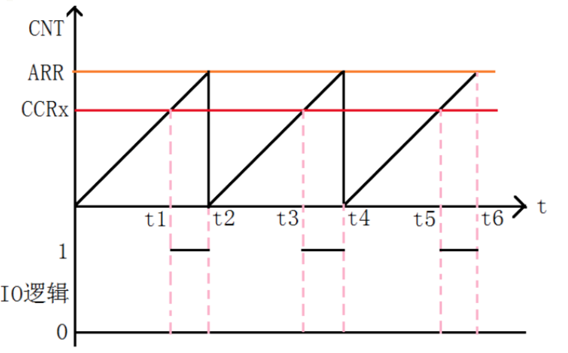
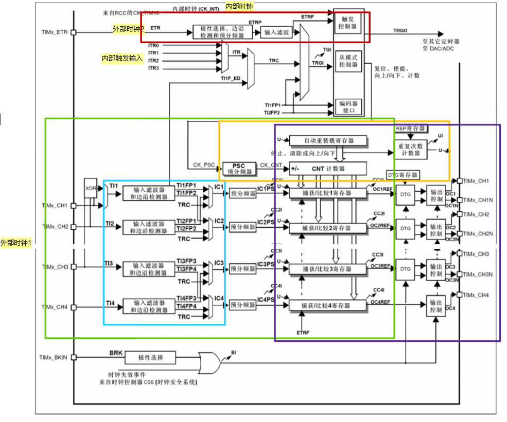
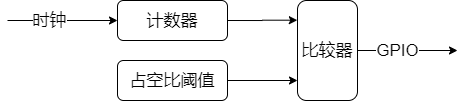
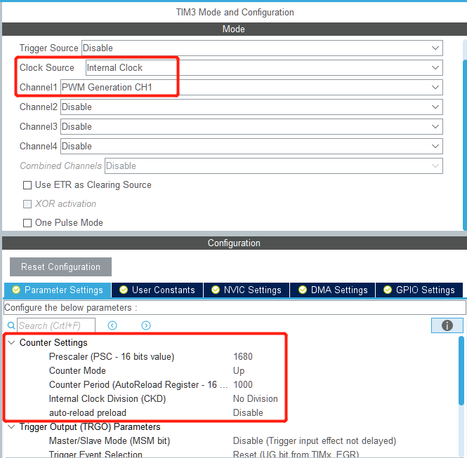
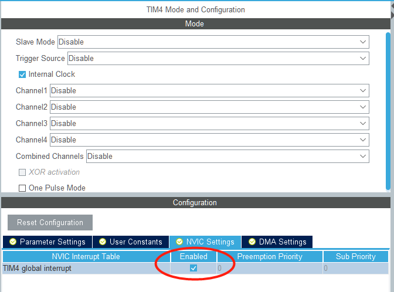

# 第二章 定时器与PWM

上一章中采用延时的方法实现了PWM对LED的控制，其中也提到可已使用定时器实现。从延时法中可以看到只要在特定计数值处控制IO口电平变化即可达到PWM的效果，并且不需要采用任何延时。

这个章节我们将研究如何使用定时器，以及如何使用定时器实现PWM输出。单片机系统最大的优点是实时性高，但是在第一章中为了检测按键和PWM我还是使用了延时函数，项目工程逐步增加后，比如会使程序的逻辑变得更加复杂。而定时器可以很好的解决这个问题，定时器就像闹钟一样，在特定的时间发出信号，告诉程序执行特定代码即可，例如按键扫描函数，只需要每10~20ms调用一次即可，我们就可以使用一个周期为20ms的定时器即可代替程序中的延时函数。

本章我们先使用定时完成LED的PWM控制，然后了解定时器工作原理，进一步使用定时实现延时完成按键的状态检测。

* 使用定时器完成PWM控制LED亮度
* 定时器基本原理
* 定时器中断计时器，例如计时器代替延时函数完成按键检测

## PWM控制LED亮度

基于`demo_L2_timer_pwm.ioc`创建工程，此工程与Chapter_001中所用工程的区别在于`PA4上的LED采用了PWM进行配置`。定时器配置周期为10ms，100Hz。

工程已经完成了PWM的初始配置，使用中只需要调用定时器的接口函数启动PWM，并配置占空比即可。

HAL库提供的接口函数为`HAL_TIM_PWM_Start`和`__HAL_TIM_SET_COMPARE`分别可以启动定时器和控制PWM占空比。但是两个函数的入口参数中都需要访问tim.c中定义的变量htim3，所以为了保证代码的收敛性，我们重新封装2个函数完成定时器的启动和修改PWM占空比。

```c
// tim.c
/* USER CODE BEGIN 1 */
void led_pwm_en(void)
{
    HAL_TIM_PWM_Start(&htim3, TIM_CHANNEL_1);
}

void setTimer3PwmDutycycle(uint8_t dutycycle)
{
    __HAL_TIM_SET_COMPARE(&htim3, TIM_CHANNEL_1, dutycycle);
}
/* USER CODE END 1 */
```

为了生成hex格式文件还需要在工程属性中完成如下配置：C/C++ Build->Settings->MCU Post build outputs中勾选`Convert to intel Hex file(-O ihex)`。

在while(1)之前调用这两个函数即可控制LED点亮。

定时器实现的PWM控制LED亮度原理为：



### 翻转：按键控制改变PWM占空比

调用chapter中的按键捕捉函数，根据按键结果控制占空比从0~100%变化，步进为10%。

## 定时器是如何工作的

虽然上面的两行代码完成了PWM的控制，但是单片机中的定时器是如何工作的呢？

单片机内部的定时器框图如下：

由图可看出定时器包括：

* 时钟源选择：内部时钟/外部时钟
* 时基单元：对时钟源进行预分频得到计数时钟，并把时钟给到计数器，计数到设定值时自动重载。
* 输入捕获：包含输入通道选择，脉冲捕获，预分频，最后送给捕获/比较寄存器。此通道可用于脉宽测量和频率测算
* 输出比较：当计数器的值与比较寄存器的值相同时输出信号发送跳变。

简化一点的定时器结构可表示为：



简单理解就是计数器对某个频率的时钟进行计数，计数到设定值则重新开始计数，同时在计数过程中达到某些临界值时会输出控制GPIO的高低电平。例如0值和与占空比对应的阈值。这个计数周期有点像挂钟的秒针，走一圈为一个计数周期，例如占空比为50%，那么在秒针指到12和6的时候分别控制GPIO电平为高和低。

### 定时器拓展

**定时器用途**

* 配置定时器可实现特定周期的中断，通过中断中计数法计时，或直接周期性触发特定事件，如ADC/DAC
* 利用输入捕获功能实现脉冲计数器，如统计特定时间内按键被按下次数，或某脉冲发送次数，也可以计算某脉冲信号频率或占空比
* 利用脉输出比较器实现脉冲发生器，如产生PWM波或特定频率的方波。
* 定时器产生的中断计时器也可以用于实现周期性执行特定任务。

**定时器分类**
STM32的定时器有：高级定时器、普通定时器、基本定时器、看门狗定时器、系统嘀嗒定时器。其中嘀嗒定时器就是上面使用的`SysTick`。不同的定时器的功能也不完全相同，主要体现在计数器方向（计数方式：递增、递减、递增递减），是否支持捕获/比较功能，是否支持互补输出。

* 高级定时器：全功能,timer1和timer8
* 普通定时器：不支持互补输出（同时控制2个IO口输出，主要用于控制电机运动），timer2-5，timer9-14
* 基本定时器：不支持互补输出，不支持捕获/比较，只支持向上计数，timer6和timer7

看门狗定时器是用于防止程序异常发生时触发系统复位用的，启用看门狗后需要在定时时间到之前重置计数器（此动作称作喂狗），如果不能及时喂狗，则定时器将触发系统复位。

既然定时器可实现各种功能，那么我们就用定时器来实现一个最简单的功能：延时。实现思路是定时器中实现对某个变量的计数，在主函数中根据计数值的不同判断某语句/函数的是否执行，从而实现某语句或函数的周期执行。进一步可实现按键的检测，而不需要使用延时等待函数。

## 定时器延时

定时器的计数时钟的配置等都是在CubeMX工具中完成的。以PWM为例主要配置如下图：



主要包括几个部分：时钟源选择、Counter Settings配置（实际上是预分频器和技术周期的设置）。其中上图中定时器输入时钟为168MHz，所以分频器设置为1680，即给计数器的频率为100KHz，技术周期为1000个计数时钟，因此定时器频率为100Hz。

### 翻转：配置定时4，周期为1ms

定时器频率为1KHz

定时器周期有了，如何周期地进行计数呢。PWM是自动完成了对GPIO的控制，那么是否能自动完成对某个变量值的技术呢？答案是肯定的不过与PWM不同的是需要通过回调函数实现。

## 定时器中断与回调函数

在单片机中中断是个基础概念，说的是在特定事件发生后CPU自动暂停while(1)主循环转去执行事件处理代码，执行完后再返回到while(1)中继续执行原来程序。定时器中断是很多中断里的一种。为了可以使用中断我们需要在cubemx中配置以开启中断。



### 启动定时器

定时器的启动与启动PWM类似：

```c
HAL_TIM_Base_Start_IT(&htim4);
```

类似的接口函数还有：

* HAL_TIM_Base_Start：启动定时器不产生中断
* HAL_TIM_Base_Start_IT：启动定时器产生中断
* HAL_TIM_Base_Start_DMA：带DMA启动定时器

与Base对用的还有前面用到的PWM、IC(input capture)、OnePulse、Encoder。详细可参考`stm32f4xx_hal_tim.h`

### 回调函数

执行上面代码调用后定时器会产生中断，但是默认的工程中定义的是若定义回调函数，函数中没有执行任何代码。需要使用需用户重定义回调函数`HAL_TIM_PeriodElapsedCallback`。

```c
uint16_t tim4_cnt = 0;
void HAL_TIM_PeriodElapsedCallback(TIM_HandleTypeDef *htim)
{
    tim4_cnt += 1;

    if (tim4_cnt > 1000)
        tim4_cnt = 0;
}
```

## 按键检测

在while(1)中判断tim4_cnt变量是否发生变化，当发生变化时调用函数`key_scan`即可。这样就可以避免在Chapter_001中使用的延时函数了。

```c
tim4_start(); //此函数需要自行实现

uint16_t key_scan_delay_cnt = 0;
while(1)
{
    if(0 == tim4_cnt % 10) //执行周期为10ms
    {
        if(key_scan_delay_cnt != tim4_cnt)
            if(key_scan() == 1)
            {
                //todo
            }
    }
}
```

### 翻转：实现按键控制LED亮度

调用chapter中的按键捕捉函数，根据按键结果控制占空比从0~100%变化，步进为10%。


