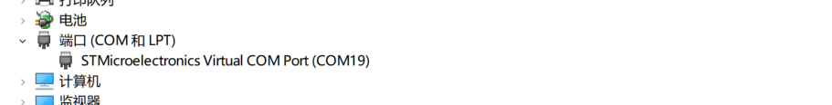
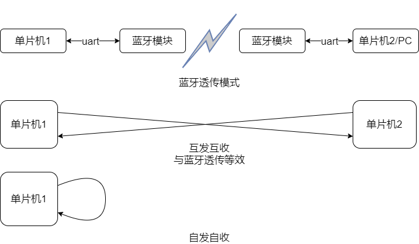
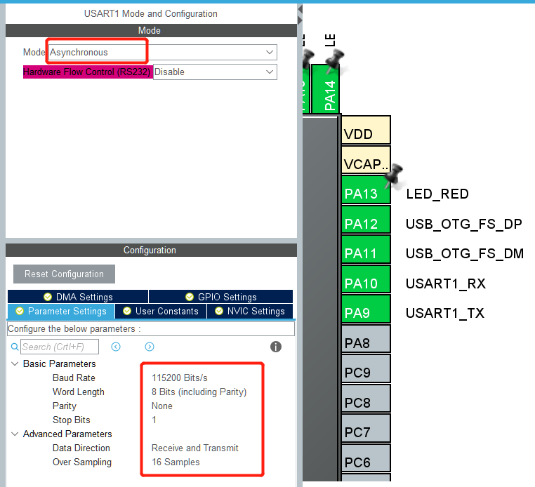
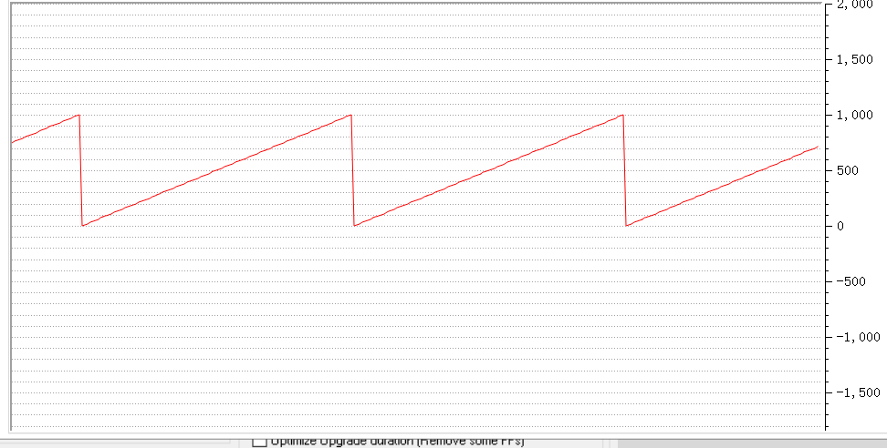

# 第三章 串口通信

通信是物联网设备最重要的一个环节，如果不能与外接通信那么就无法完成联网的重要功能。通信有多种实现方案：串口通信，USB通信，无线通信等。无线通信需要借助通信模块，单片机与通信模块之间也是需要通信的，这里一般采用的还是串口通信方案。USB通信反而使用的不多，但是当设备与PC连接时使用USB通信也是一个不错的选择，这里的通信也分为两种：PC像访问U盘一样访问设备完成文件读写；设备在PC端被识别为串口，使用串口通信协议完成通信。

本章我们首先将使用USB虚拟串口的方式让单片机与PC进行通信，单片机通过虚拟串口给PC发送设备工作日志，研发人员根据日志进行功能调试，这在研发过程中是非常常见，也是非常重要的调试手段。

然后我们会继续研究单片机的串口接口通信，分别实现1个串口的自发自收和2个串口的互发互收。

同时涉及到通信时，通信协议也是必不可少的内容，所以我们将使用最简单的AT执行进行通信协议的研究。

教程设计：

* USB虚拟串口-串口识别
* 翻转：识别处串口
* STM32通过USB发送数据
* 翻转：通过USB发送0-9字符
* 封装实现usb_printf()函数
* 翻转：通过usb_printf发送日志，如设备版本号等
* 上一步遇到发送问题，设备启动后需要做一s延时才能发送数
* 上一步遇到问题，连续两个printf会出问题，第二数据发送失败，尝试问题分析与解决
* ASCII码与十六进制数的发送
* 翻转：验证发送数据长度从1到256没有问题。
* 串口通信，配置串口完成数据发送、自发自收
* 翻转：自发自收后转发到usb数据接口
* 通信协议：山外调试助手支持虚拟示波器的功能，数据的接收是需要遵循特定格式的
* 翻转：模拟锯齿波通过串口完成发送

## USB虚拟串口

使用`demo_L3_serial_communication.ioc`文件创建工程，在PC上识别出串口设备，此步需要先在PC端安装驱动。

[官方驱动下载链接](https://www.st.com/zh/development-tools/stsw-stm32102.html)

识别结果如下：



识别到串口之后就可以尝试通过虚拟串口给PC发送数据了，不过发送之前还是要准备一个串口工具：**山外串口助手**。使用串口助手可打开和关闭识别到的串口。

### 翻转：识别串口

## 虚拟串口发送数据

USB的单次数据发送比较简单可直接调用函数`CDC_Transmit_FS`完成。但是当需要连续发送数据时就可能出错，因为数据发送过程是由底层代码控制完成的，所以当函数返回时数据可能还没有发送完成。这时尝试再次发送数据就可能发生错误。

我们先用延时函数来防止连续两次数据发送间隔太短。

```c
uint8_t tx_data[] = {'h', 'e', 'l', 'l', 'o', '\n'};

while(1)
{
    CDC_Transmit_FS(tx_data, sizeof(tx_data));
    HAL_Delay(1000); // 底层Tick定时器提供的毫秒级延时函数
}
```

PC端可以正常接收数据，那么我们是否可以对`CDC_Transmit_FS`函数进行封装用类似printf函数的方式进行数据发送呢，这样的话就可以用这个函数输出工作日志给PC了。例如封装为`usb_printf`。

### 翻转：串口发送字符串0~9

## usb_printf

由于USB和UART通信不同，所以不能通过fputc函数的重定向完成pritnf函数，而是需要重新实现usb_printf函数。此函数中包含两部分：输入数据解析和数据发送。

```c
#include <stdarg.h>

void usb_printf(const char *format, ...)
{
    va_list args;
    uint32_t length;

    va_start(args, format);
    length = vsnprintf((char *)UserTxBufferFS, APP_TX_DATA_SIZE, (char *)format, args);
    va_end(args);
    CDC_Transmit_FS(UserTxBufferFS, length);
}
```

注意：需要添加相应头文件和头文件引用。
注意：这里需要使用山外串口助手可正常接收数据，部分串口助手会出现打不开串口的问题。

### 翻转：使用usb_printf打印日志

在进入while(1)之前打印CPU型号，版本号，日期信息等。同时while(1)中连续发送两条日志

尝试中会发现问题:

1. 写的日志在打开串口之前就已经发送完成了
2. while(1)中的日志只接收到了第一条，第二条没有收到。

第一个问题容易解决，打印日志前延时一段时间，等待PC端打开串口
第二个问题需要仔细研究。

### 如何确保USB完成数据发送

仔细了解CDC_Transmit_FS函数可以发现此函数是有返回值的如果数据被正常发送则返回`USBD_OK`，那么可以根据这个结果我们控制1个LED的亮灭进行一些简单的调试。

```c
if (USBD_OK != CDC_Transmit_FS(UserTxBufferFS, length))
    HAL_GPIO_TogglePin(LED_RED_GPIO_Port, LED_RED_Pin);  //发送失败改变LED状态
```

经调试我们发现LED一直在闪烁，所以我们可以推测在执行第二次数据发送的时候没有成功。在这里我们一个比较直接的解决办法是在`CDC_Transmit_FS`函数中等待数据发送完成，因为这个过程我们认为不会占用很长时间。

实现方法是在CDC_Transmit_FS中尝试发送数据后判断USB接口的状态，知道USB接口空闲在退出，实现代码如下：

```c
  uint16_t retry = 0;
  while(hcdc->TxState == 1)
  {
      retry++;
      if(retry == 0xfff0)
      {
          return USBD_FAIL;
      }
  }
```

好了现在我们就可以正常的进行日志打印了

### 翻转：解决设备版本号等日志的打印问题

经验证需要延时约1秒左右时间才能正常打印while(1)之前的日志。

## ASCII码与十六进制数的发送

使用usb_printf完成的数据发送实际上发送的是ASCII码，例如usb_printf("data:%d",100);实际上从PC串口收到的内容是字符串"data:100"，这里的100实际上是字符'1','0','0'，而不是可以进行算数运算的100或0x64。所以usb_printf实现了字符数据的发送，那么如何封装一个对某个数据缓存区的数据发送函数呢。

实际上函数`CDC_Transmit_FS`本身就是用于把某个缓冲区的数据通过USB发送出去的，直接调用即可，当然也可以对此函数进行简单的封装。在研究USB数据发送的时候有文章提到USB是按64字节为一个单位进行数据传递的，而工程文件中定义的发送缓冲区长度为2048，那么是否需要用户特殊处理64临界数据量的问题呢。我们可以写一个简单的数据发送代码进行验证。

### 翻转：完成不同数据长度内容发送的是否正常的验证

```c
uint8_t tx_data[256];

for(int i; i < 256; i++)
{
    tx_data[i] = i;
}

int cnt = 0;
while(1)
{
    cnt += 1;
    if (cnt > 256)
        cnt = 1;

    CDC_Transmit_FS(tx_data, cnt);
    HAL_Delay(300);
}
```

经测试数据接收没有出现问题。如此我们可以知道库函数已经做了很好的拆包处理。

## USART串口通信

上面的日志是为了方便嵌入式单片机调试而采用的USB虚拟串口。那么如果想把单片机内部有效数向外输出该如何实现呢？上面我们已经提到了蓝牙透传模块，单片机通过串口与蓝牙模块通信，为了实现串口通信我们先使用单片机的串口进行自发自收测试一下通信效果。

数据收发示意如下：



项目中单机测试阶段可采用单片机与PC互发互收通信，也可以采用自发自收通信。这里我们使用自发自收进行串口通信测试。在定时中学习中我们已经接触到了cubemx的配置，在串口通信中同样需要自行配置完成。

### 串口接口配置

在cubemx中串口的配置包括：端口参数配置和中断选择，如果用到还会有DMA配置。参数配置部分根据需要选择即可，这时因为串口通信中需要设置波特率、数据位数、校验方式、停止位等参数，只有通信双方采用相同配置才能正常通信。实训中选择串口2进行配置，结果如下：



另外需要在`NVIC Settings`中勾选`USART2 Global Interrupt`选项。使能串口中断，这样就可以在串口中断的回调函数中完成一些特定处理了。

### 数据发送

串口的数据发送是通过调用如下函数完成的：

```c
HAL_StatusTypeDef HAL_UART_Transmit(UART_HandleTypeDef *huart, uint8_t *pData, uint16_t Size, uint32_t Timeout);
```

### 翻转：使用上述函数完成数据发送

封装usart2_send函数，函数中使用`HAL_UART_Transmit`函数完成数据发送。根据函数返回值判断是否发送成功。

```c
void usart2_write(uint8_t* data, uint16_t len)
{
    // todo
    // 可用LED灯闪烁表示函数被调用，并正确执行
}
```

数据虽然发送出去了，但如何接收呢？为了看到发出去的数据我们可以用跳线短接PA2和PA3，使得从PA2发送出去的数据从PA3口进行接收。

### 数据接收与自发自收

HAL库中用于数据接受啊的函数有`HAL_UART_Receive`，`HAL_UART_Receive_IT`和`HAL_UART_Receive_DMA`可用于接收数据，其区别是`HAL_UART_Receive`为阻塞型接收，`HAL_UART_Receive_IT`为非阻塞型接收，在接收到指定数据长度后会产生中断，`HAL_UART_Receive_DMA`则不占用CPU资源，直接把接收到的数据存入指定buf，在高速串口通信中使用DMA可降低CPU压力。

为了使程序便于维护，同时尽量不使用阻塞型接收，因为发送数据是可控的，但是接收数据在接收端是不知道数据何时被发送的，所以采用中断方式进行数据接收。

接收的思路是：

* 发起特定长度是数据接收
* 接收到设定长度时调用中断回调函数
* 在回调函数中设置数据接收完成标志位
* 在主循环中根据标志为转发数据，并启动下次数据接收

为了正常使用需要定义变量：

```c
uint8_t rxbuf[16];
uint8_t rxDone;
```

数据发起接收函数如下：

```c
void usart2_read_start()
{
    HAL_UART_Receive_IT(&huart2, rxbuf, sizeof(rxbuf));
    rxDone = 0;
}
```

当数据接收完成后会产生中断，并在中断中函数`HAL_UART_RxCpltCallback`函数。单片机程序中有个基本的原则是中断函数中不能执行时间太长，而串口数据的处理往往需要缓存、解析、处理，因此不适宜放在中断中进行，这里可以设置标志位说明串口有数据需要处理即可，同时为了保证串口接收不丢数，还需要在中断中再次启动串口数据接收，这就要求我们设置标志位的同时还需要对串口数据进行缓存。简单整理一下串口接收中断中需要处理的事情：

* 接收数据缓存
* 置位缓冲区数据有效标志位
* 启动新的数据接收

所以，中断回调函数可实现如下:

```c
void HAL_UART_RxCpltCallback(UART_HandleTypeDef *huart)
{
    if(huart->Instance==USART2)
    {
        rxDone = 1;

        for(int i=0; i < sizeof(rxbuf1); i++)
            rxbuf2[i] = rxbuf1[i];

        HAL_UART_Receive_IT(&huart2, rxbuf1, sizeof(rxbuf1));
    }
}
```

### 翻转：接收到的数据转发到USB虚拟串口

实际上是串口接收数据的处理函数，可简写为：

```
if rxDone is 1
    rxDone = 0
    send data to usb
```

## 通信协议

通信协议是指双方实体完成通信或服务所必须遵循的规则和约定。

### 为什么需要通信协议

因为串口通信为串行通信，收发双方是一个字节一个字节通信的，如何知道每个字节的含义呢？这里的含义实际上是语义的概念，就是接收到的数据是代表什么含义。另外一个概念是语法就是语义内容用什么样的格式进行传递，这个主要是为了解决从串行数据流中找到完整的语句。

一个简单的协议格式：收发双方都以字符串形式通信，每个完整的语句以换行符`\n`结束，语句内容包含3个部分：命令，分隔符，参数。

例如："NAME=CHINA\n"

### 虚拟示波器的数据格式

把一个常数按指定格式完成发送：
查看山外串口助手使用手册了解到虚拟示波器的通信协议为：[0x03][0xFC][..数据..][0xFC][0x03]。假设数据是uint16_t格式我们可以简单实现为

```c
uint8_t data[] = {0x03, 0xFC, 0x00, 0x00, 0xFC, 0x03};
uint16_t value = 0;

value += 10;
if (value > 1000)
    value = 0;
data[2] = value&0xFF;
data[3] = (value>>8) & 0xFF;
CDC_Transmit_FS(data, sizeof(data));
HAL_Delay(10);
```

我们可以看到波形数据如下:



### 翻转：使用2个信道输出三角波数据和锯齿波数据并按上述格式完成数据发送

自行设计实现

### 翻转：使用蓝牙透传模块与PC进行数据通信

使用山外虚拟示波器通信协议，USART串口通信的应用。

## 参考

[参考：一个严谨的STM32串口DMA发送&接收（1.5Mbps波特率）机制](https://acuity.blog.csdn.net/article/details/108367512)
