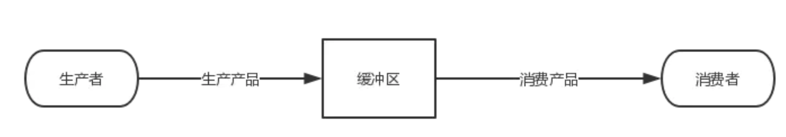

# 第四章 单片机程序架构

随着外设的增加要想把各种功能都加进来，程序必然变得十分复杂，尤其是各个部分为了同步等原因会加入一些延迟，这些延迟会让程序的执行时间不可控从而引入一些不可预测的问题或缺陷。

另一方面，客户可能会在研发中途增加新的功能，这时候如果程序设计的不好，增加新功能会带来许多麻烦，可能会推翻之前的很多代码，进而增加工作量。为了避免这种情况发生，选择合适的程序架构就显得十分有必要了。

为了得到最佳的程序架构，我们对单片机程序设计中常用的架构进行了简单的研究，主要有有：三种：顺序执行、时间片轮询、操作系统。

## 顺序执行法

顺序执行也称作前后台顺序执行，适用于复杂度低，实时性和并发性要求不高的应用。其程序在执行完初始化后直接在while(1)中调用其他子函数完成各种功能即可。程序中不考虑各子函数带来的延时。

* 优点：程序架构直观，逻辑简单。需先设计好流程图再进行程序设计
* 缺点：实时性低，当程序复杂度提升时，程序维度和调试难度会增大很多。不利于升级维护，也不利于代码优化

## 翻转：顺序执行法实现按键控制LED灯亮度

```c
lastKeyValue
keyActive

while 1
    // 按键检测
    if keyValue != lastKeyValue
        delay 20ms
        if keyValue != lastKeyValue
            lastKeyValue = keyValue
            if keyValue == 0
                keyActive = 1

    // 按键结果处理
    if keyActive == 1
        keyActive = 0
        setPwmDutycycle()

```

如果在这个基础上增加一个新的功能，每秒钟通过USB上发一个心跳包，打印当前的时间，表示设备正常工作。

根据之前章节学习，我们知道可以使用定时器代替上述代码中的延时函数。实际上是用定时器优化了顺序执行代码结构。但是我们也引入了一些问题，例如按键检测，我们需要使用如下代码来完成:

```c
    if(0 == tim4_cnt % 10) //执行周期为10ms
    {
        if(key_scan_delay_cnt != tim4_cnt)
            if(key_scan() == 1)
            {
                //todo
            }
    }
```

而我们实际上需要调用的函数是`key_scan()`，当功能增加后会出现很多上面这样的代码。这会让我们的程序变得庞大，难以维护。我们是否能对上述代码进行改造，形成一种标准的模板，如需增加新的功能，只增加类似与keu_scan一样的功能函数。如果可以的话代码的可维度程度将大大降低。

事实上，我们想要的这个标准模板是有的，那就是时间片轮询法的模型。

## 时间片轮询法

时间片轮询法是一种比较简单易用的系统架构之一，它对系统中的任务调度算法是分时处理的。核心思想是把CPU的时间分时给各任务使用。常用的方法是定时器，调度器放在定时器中，需要执行时设置特定的标志位，然后在主循环中根据标志位执行不同的任务。

需要注意的是这里的任务不能执行时间太长，尽量避免使用延时或轮询等待。任务执行时间过长会导致无法保证其他任务的按时执行。

时间片轮询法的功能远比不上操作系统，但是其结构简单，在某些特定场景中可发挥比嵌入式操作系统更好的性能。

例如，系统复杂度没那么高，不必要上操作系统。有实时性要求，但并不是非常高。

应用举例，假定我们有3个定时执行的任务：每秒执行一次时钟显示，因为时钟最小单位是秒，所以每秒执行一次即可；每20ms扫描一下按键，起到防抖作用，同时也避免了按键遗漏；每30ms更新一次LCD内容，例如按键按下后给出一些提升。这样我们就可以设计3个独立的任务，并利用定时进行分别调度。

## 时间片轮询法架构

时间片轮询应用程序的架构非常简单，包括任务结构体，中断处理函数，任务轮询函数。

### 结构体设计

```c
// 任务结构
typedef struct {
    uint8_t task_id;                    // 任务 ID
    uint16_t task_interval;             // 任务运行间隔时间
    void (*task_entry)(void);           // 要运行的任务
    volatile uint16_t task_tick_ms;     // 计时器
}task_info_t;
```

这里task_entry是一个函数指针，指向不同的任务函数。有了这个结构体之后，可定义一个结构体数组用于管理不同任务。

```c
// 假设有3个任务：时钟显示，按键扫描，和工作状态显示
task_info_t timing_task_array[] =
{
    {0, 100, task_disp_clock_running, 0},   // 显示时钟，执行周期1s
    {1, 20,  task_scan_key_running, 0},     // 按键扫描，执行周期20ms
    {2, 30,  task_disp_ws_running, 0},      // 工作状态显示，执行周期30ms
};
```

### 中断处理函数

中断处理函数是指定时器中断时被调用的函数，例如定时器周期为10ms，那么可在中断函数中对数据结构中的`task_tick_ms`进行加计数，计数值等于`task_interval`时停止。这里设置定时器周期为10ms是为了避免频繁发送定时器中断，实际工程中应根据需要调整。

```c
// 为每个任务计时，每次中断加 10ms
#define TIMER_PERIOD_MS 10
void timing_task_tick(void)
{
    uint8_t task_index = 0;

    while (task_index < ARRAY_SIZE(timing_task_array))
    {
        if (timing_task_array[task_index].task_tick_ms < timing_task_array[task_index].task_interval)
        {
            // 每次加一个定时器周期 10ms
            timing_task_array[task_index].task_tick_ms += TIMER_PERIOD_MS;
        }
        task_index++;
    }
}
```

### 任务轮询函数

```c
// 任务计划表，轮询执行任务
void timing_task_scheduler(void)
{
    uint8_t task_index = 0;

    while (1)
    {
        for (task_index = 0 ; task_index < ARRAY_SIZE(timing_task_array); task_index++)
        {
            if (timing_task_array[task_index].task_tick_ms >= timing_task_array[task_index].task_interval)
            {
                timing_task_array[task_index].task_tick_ms = 0;
                timing_task_array[task_index].task_entry();
            }
        }
    }
}
```

程序陷入死循环，依次判断每个任务是否符合执行要求。如果是，则执行相应的任务函数；否则等待计时。

## 作业

实现按键控制LED呼吸灯亮度任务：

* 按键检测任务：检测按键的下降沿，检测到时按键计数值加1
* 呼吸灯控制任务：逐渐控制PWM占空比，达到控制LED亮度的目的。同时根据按键计数是否变化，据此控制PWM。

这里按键状态的检测和处理采用了软件设计中`生产者与消费者`的思想。



按键属于生产者，每次按下计数值加1。呼吸灯控制任务为消费者，处理按键结果。这里按键产生和按键结果处理被分开了，一定程度上实现了代码的解耦。

当然真正的生产者和消费者解决的问题是：
> 生产者和消费者问题是线程模型中的经典问题：生产者和消费者在同一时间段内共用同一个存储空间，生产者往存储空间中添加产品，消费者从存储空间中取走产品，当存储空间为空时，消费者阻塞，当存储空间满时，生产者阻塞。

按键检测任务伪代码：

```c
keyPreActive
lastKeyValue
keyActive
void task_key_scan()
{
    if keyValue != lastKeyValue and keyValue == 0   //捕捉下降沿
        lastKeyValue = keyValue
        keyPreActive = 1                            //用于按键防抖
    else
        if keyPreActive == 1 and keyValue == 0
            keyActive = 1
        keyPreActive = 0
}
```

呼吸灯控制任务伪代码：

```c
void task_led_ctrl()
{
    if keyActive == 1
        keyActive = 0
        setPwmDutycycle()
}
```

## 操作系统

操作系统除支持时间片轮询法中的任务调度外，任务的执行也不需要用户管理，同时操作系统还支持时间管理、消息机制、信号量等高级功能。

使用操作系统或时间片轮询法会让用户程序设计变得简单，更适合复杂项目中，可方便地进行任务拆分团队协作。同时项目的维护起来也比较容易。


[参考1](https://www.cnblogs.com/suanite/p/10163392.html)
[参考2](https://blog.csdn.net/qq_38190041/article/details/93192326?utm_medium=distribute.pc_relevant_download.none-task-blog-baidujs-1.nonecase&depth_1-utm_source=distribute.pc_relevant_download.none-task-blog-baidujs-1.nonecase)
[参考3](https://www.cnblogs.com/lzc978/p/12902479.html)
[参考3]()


