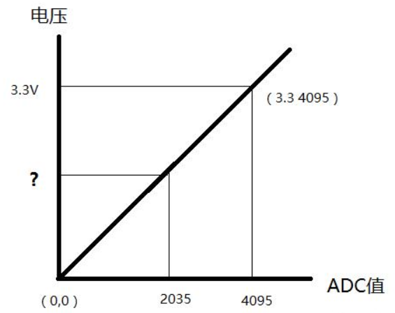
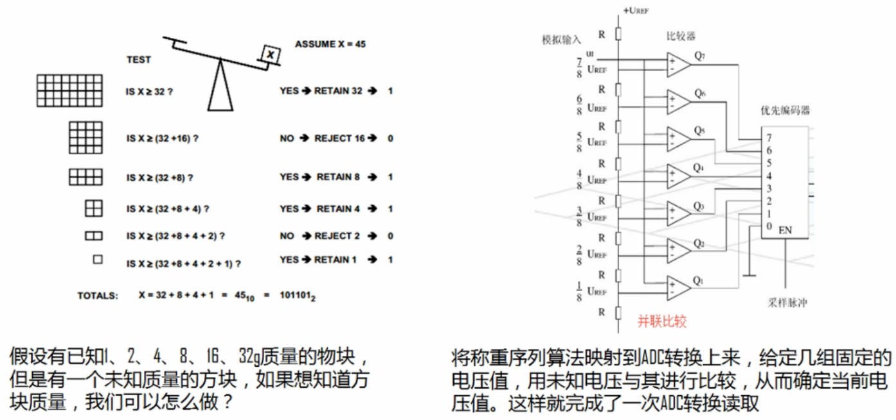
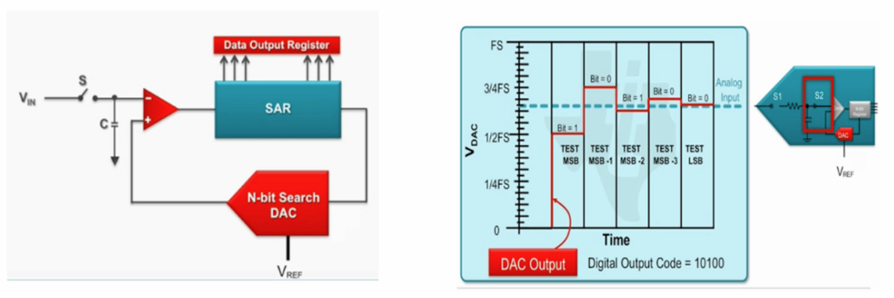
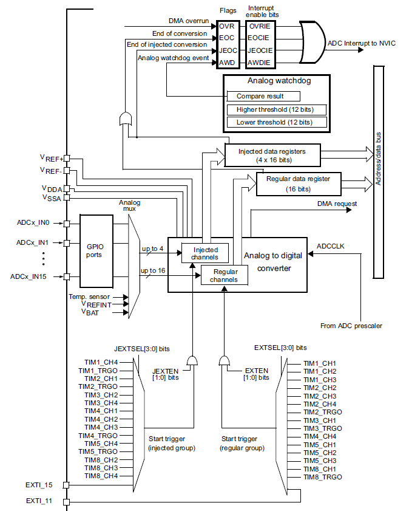
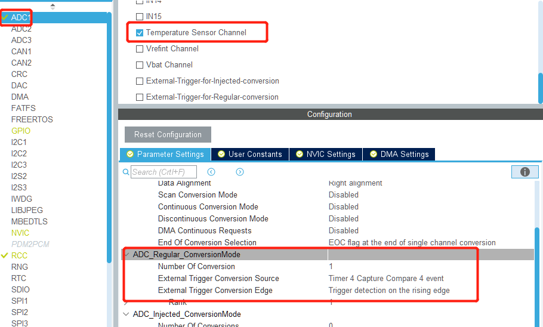

# 第五章 模拟数据采集

## ADC-芯片温度测量

ADC和DAC是单片机外设中比较特殊的一类，其主要完成了数字量与模拟量之间的转换，尤其是ADC在各模拟量输出的传感器中被大量用到。

### 最简单的理解ADC

在不了解ADC转换过程的情况下理解ADC，我们可假设模拟量0~VCC对应数字量0-4095，那么任意的模拟量输入对应的数字量：Ain * (4096 / VDD)。假定VDD=3.3V，我们可从下表更直观的理解ADC。



ADC转换的结果是数字量，那么如何根据数字量得到ADC输入接口的模拟量的值呢？

**Ain = adcOut * VDD/4096**

[参考](https://blog.csdn.net/houzhenxing/article/details/73558011?utm_medium=distribute.pc_relevant.none-task-blog-BlogCommendFromBaidu-2.nonecase&depth_1-utm_source=distribute.pc_relevant.none-task-blog-BlogCommendFromBaidu-2.nonecase)

### ADC转化过程

最简单的是把输入电压与一些特定的电压进行比较，以此来确定输入电压的范围，如下图所示。



上述方法虽然简单，但是要想提高ADC的转换精度就需要大量的电压比较器，不适合高精度转换。后来设计处了逐次逼近法，简单的说就是首先将输入信号与某基准电压的1/2进行比较，确定转换结果的最高位，然后用这个结果加上基准电压的1/4，再次与输入信号进行比较得到次高位的结果，类似方法逐次得到每一位的结果，所以叫做逐次逼近法。看上去次方法可无限的对比下去，然而对计准电压进行多次细分后就会变得足够小，在比较时会被噪声干扰使得信号输出不准确。所以一般高精度的ADC有效位数在11位左右。其转换过程如下图：



另外ADC的过程实际上也是一个采样过程，每秒钟采样次数称作采样率，这里需要提到奈奎斯特采样定理，即：如果对原始信号进行采集，采样率必须大于原始信号的2倍，这样才能正常还原处原始信号，否则会发生混叠，一般会选择2.5倍以上频率作为采样频率。

[参考](https://blog.csdn.net/LeonSUST/article/details/81088931?utm_medium=distribute.pc_relevant.none-task-blog-BlogCommendFromMachineLearnPai2-3.nonecase&depth_1-utm_source=distribute.pc_relevant.none-task-blog-BlogCommendFromMachineLearnPai2-3.nonecase)

### 片上温度测量

**ADC cubemx配置**

ADC配置选择ADC1来进行温度检测，如下图选择温度检测通道。图中的ADC1，ADC2，ADC3表示单片机内部有3个独立的ADC转换器，右侧的IN0~IN15表示ADC转换器可同时接16路输入，内部通过复用开关分时复用完成各通道的数据转换。


ADC接口函数如下：

```c
HAL_StatusTypeDef HAL_ADC_Start(ADC_HandleTypeDef* hadc);
HAL_StatusTypeDef HAL_ADC_Stop(ADC_HandleTypeDef* hadc);
HAL_StatusTypeDef HAL_ADC_PollForConversion(ADC_HandleTypeDef* hadc, uint32_t Timeout);

HAL_StatusTypeDef HAL_ADC_PollForEvent(ADC_HandleTypeDef* hadc, uint32_t EventType, uint32_t Timeout);

HAL_StatusTypeDef HAL_ADC_Start_IT(ADC_HandleTypeDef* hadc);
HAL_StatusTypeDef HAL_ADC_Stop_IT(ADC_HandleTypeDef* hadc);

void HAL_ADC_IRQHandler(ADC_HandleTypeDef* hadc);

HAL_StatusTypeDef HAL_ADC_Start_DMA(ADC_HandleTypeDef* hadc, uint32_t* pData, uint32_t Length);
HAL_StatusTypeDef HAL_ADC_Stop_DMA(ADC_HandleTypeDef* hadc);

uint32_t HAL_ADC_GetValue(ADC_HandleTypeDef* hadc);

void HAL_ADC_ConvCpltCallback(ADC_HandleTypeDef* hadc);
void HAL_ADC_ConvHalfCpltCallback(ADC_HandleTypeDef* hadc);
void HAL_ADC_LevelOutOfWindowCallback(ADC_HandleTypeDef* hadc);
void HAL_ADC_ErrorCallback(ADC_HandleTypeDef *hadc);
```

一个简单的ADC转换过程为：

* HAL_ADC_Start：启动ADC转换
* HAL_ADC_PollForConversion：等待ADC转换完成
* HAL_ADC_GetValue：读取ADC转换结果
* HAL_ADC_Stop：停止ADC转换
* 数据处理

我们可实现温度读取函数：

```c
HAL_StatusTypeDef readCpuTemp(float *temp)
{
    uint32_t adcValue = 0;
    float temperature = 0;
    HAL_StatusTypeDef rt = HAL_OK;

    HAL_ADC_Start(&hadc1);                                      // 启动ADC

    rt = HAL_ADC_PollForConversion(&hadc1, 10);                 // 等待ADC转换完成

    if (rt == HAL_OK)
    {
        adcValue = HAL_ADC_GetValue(&hadc1);                    // 读取ADC转换结果
    }

    HAL_ADC_Stop(&hadc1);                                       // 停止ADC

    if (adcValue != 0)
    {
        // 数字量转为模拟量
        temperature =  ((adcValue * 3.3)/4096 - 0.76) *1000/2.5 + 25 ;
        *temp = temperature;
    }else
    {
        rt = HAL_ERROR;
    }

    return rt;
}
```

在main函数中调用此函数即可获取当前的温度数据。

```c
// main.c line 121
    float temp = 0;
    if(HAL_OK == readCpuTemp(&temp))
    {
        // STM32不支持浮点数打印，所以转换为整数打印
        usb_printf("cpu temperature=%d\r\n", (uint32_t)(temp*100));
        HAL_Delay(1000);
    }
```

## 定时器

温度检测中为了避免串口数据打印太快，在主循环中增加了延时函数`HAL_Delay(1000);`，这个函数会让虚拟串口数据的接收和按键检测出问题，例如按键按下时间小于1秒则可能检测不到。为了解决这个问题，简单的方法是主循环中使用短时间的延时如10ms，然后对主循环进行计数，执行100次则执行一次ADC转换。

```c
    uint8_t loopCnt = 0;
    while(1)
    {
        HAL_Delay(10);
        loopCnt += 1;
        // ...

        if (loopCnt >= 100)
        {
            loopCnt = 0;
            float temp = 0;
            if(HAL_OK == readCpuTemp(&temp))
            {
                // STM32不支持浮点数打印，所以转换为整数打印
                usb_printf("cpu temperature=%d\r\n", (uint32_t)(temp*100));
            }
        }
    }
```

上面的方法是没问题的，但是采样间隔不能精确控制，并且CPU的利用率也会造成影响，在主循环中加延时始终不是一个好的选择。为了更精确的控制采样间隔，需用用到定时器功能。

要深入理解定时器触发ADC的过程需要先了解ADC内部结构如下图：



上图中下半部分列出的是`regular group(规则通道)`和`injected group(注入通道)`。其中规则通道组最多可设置16个通道，注入通道组最多设置4个通道。规则通道用于周期性进行的ADC采样，注入通道用于突发性的ADC采样。

计划使用定时器4触发ADC，由上图可看出需要使用定时器4的CH4，而ADC的触发需要产生脉冲才行，因此需要使用定时器的PWM模式。具体配置：




完成配置后需启动ADC和TIM4：

```c
HAL_ADC_Start_IT(&hadc1);
HAL_TIM_PWM_Start(&htim4, TIM_CHANNEL_4);
```

ADC的配置需要使能中断，并重新定义中断回调函数，在回调函数中回读ADC的值：

```c
// adc.c
uint32_t cpu_temperature = 0;
uint8_t cpu_temperature_active = 0;
void HAL_ADC_ConvCpltCallback(ADC_HandleTypeDef* hadc)
{
    //start data processing...
    uint32_t adcValue = 0;
    adcValue = HAL_ADC_GetValue(&hadc1);
    cpu_temperature = (uint32_t)(100*(((adcValue * 3.3)/4096 - 0.76) *1000/2.5 + 25)) ;
    cpu_temperature_active = 1;
    HAL_GPIO_TogglePin(LED_RED_GPIO_Port, LED_RED_Pin);
}

//main.c
extern uint32_t cpu_temperature;
extern uint8_t  cpu_temperature_active;

if(cpu_temperature_active == 1)
{
    cpu_temperature_active = 0;
    usb_printf("cpu temperature=%d\r\n", cpu_temperature);
}

```
