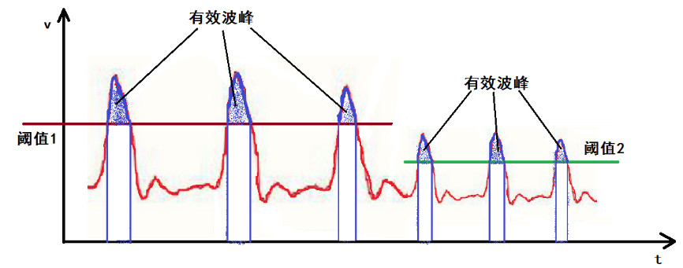

# 第六章 算法与低功耗

这一章节包含2部分内容：数据处理和低功耗。其中数据处理主要讨论如何从离散的模拟数据中计算处脉搏/心率值，低功耗主要讨论为提供便携式设备的待机时间而引出的低功耗问题。

## 心率测量

**心率**，指的是一分钟内的心跳次数，实时测量中常用的方法是测量相邻两次脉搏的时间间隔，然后用1分钟除以这个间隔得到心率。
**IBI** 相邻两次脉搏的时间间隔，单位：秒
**BPM** 心率，一分钟内的心跳次数，`BPM=60/IBI`。

### 脉搏传感器测得的波形


可以看出图中所示波形对应的心跳间隔是1.37/2=0.685s，心率值为60/0.685 = 87.6。为了得到两个脉冲的间隔，最直接的办法是识别出1个脉冲，最直观的是找到波峰。

### 识别一个脉冲信号

脉冲信号的识别有很多中方法，最简单的是设定一个阈值，当采集的数据超过阈值时认为监测到一个脉搏，并记录当前时间。看似简单的方法，细节上却又不少问题需要解决，第一个问题是阈值的选取，如下一段波形显示的是信号忽然变弱时阈值失效的情况。

**阈值选择**


如图因电压波动导致了阈值失效，使得不能正常、稳定地测量脉搏。所以在算法实现上不可能用一个固定的值来判断波峰的出现。很显然我们需要使用动态阈值，根据最近一段时间的数据计算出一个动态阈值，在下次数据计算中使用最新的阈值，如下图。



**脉搏特征选择**

根据上文波形可以看到识别波峰也有不同的选择，方法1是找到超过阈值的峰值位置，方法2是找到波形信号经过阈值的位置。两种方法都是有效的，此处我们选择方法2进行算法设计。

* 计算阈值：缓存一个波形周期内的多次采样值，得到最大、最小值，中值作为阈值。
* 寻找信号上升经过阈值临界点，中值位置时间
* 寻找下临界点，并记录中值位置时间，计算IBI
* 根据IBI计算BPM

我们用伪代码来描述算法过程：
```c
if adc_data_cnt != adc_data_cnt_last    //新的ADC采样完成
    adc_data_cnt_last = adc_data_cnt
    preData = newData;                  //缓存上次数据
    newData = adc_value;                //获取最新数据

    dataBuf[index++] = newData;         //数据缓存
    if index > MAX_SIZE                 //采集数据够一个周期
        dataBuf_max                     //计算最大值、最小值、中值
        dataBuf_min
        dataBuf_mid

    if preData < dataBuf_mid and newData > dataBuf  //判断是否满足脉搏特征
        if pulseCnt == 0                            //记录第一次脉搏时间
            t1 = currentTime
            pulseCnt = 1
        if pulseCnt == 1                            //记录第二次脉搏时间
            t2 = currentTime
            IBI = t2-t1                             //计算IBI
            BPM = 60000/IBI                         //计算BPM
            pulseCnt = 0;
```

### 信号滤波

实际监测过程中，一些抖动会导致测量数据异常，此时需要对连续两次数据变化过大的干扰信号过滤掉。这需要在上述算法中增加过滤功能，方法是在缓存数据时判断连续两次数据的变化是否超过特定阈值，如超出范围则不进行缓存。这个阈值的选择可以是波形信号峰峰值的一半或三分之二，峰峰值为max-min。

### 注意事项

* 传感器与手指之间不能施压过大，会阻碍血液流动而检测不到信号。
* 测量过程中应尽量保持稳定。

[参考1](https://www.cnblogs.com/whik/p/10631271.html)

## 低功耗设计

因为穿戴式设备一般为电池供电，所以需要考虑低功耗设计。STM32单片机为了降低功耗设计有不同的工作模式：正常模式、睡眠模式、停止模式、待机模式。这四种模式功耗依次降低，正常模式为例，电流可达到46mA，而在待机模式，电流最低只有2.2uA。因此在适当的时机让单片机工作在不同模式可有效降低设备功耗。

不同的低功耗模式各有2个触发条件：进入模式条件、退出模式条件。

**睡眠模式**

睡眠模式采取的低功耗措施为：

* 降低系统时钟速度：利用CubeMx中的Tools界面，左侧选项列中找到RUN，拖动滑块改变频率可发现当时钟从168MHz降低为90MHz时，系统电流从46mA降低到了30mA，降低了34.8%。
* 关闭不用外设达到节能目的

**停止模式**

停止模式，在睡眠的基础上更进一步把CPU内部时钟全部关闭，但是内部寄存器内容被保留。另外停止模式下片上Flash会进入调电状态

**待机模式**

在待机模式下，在停止模式的基础上不再保持寄存器和SRAM1内的数据而保留SRAM2中的数据。另外此模式下RTC和看门狗可正常工作。设备功耗将降低到2.2uA量级

不同模式的进入条件和退出条件见下图：


### 低功耗设计思路

产品的低功耗设计不只是软件配置CPU进入待机模式这么简单的，虽然标称待机模式功耗只有几个微安，但是如果电源电路或外设电路设计不合理功耗同样是降不下来。所以一个产品的低功耗设计需要从硬件和软件两个方面进行考虑。

**硬件设计：**

* 硬件设计中尽量使得不同外设的供电是可控的，可使用MOS管控制外设是否供电。
* 整机的电源管理系统需要合理选择，尤其是在低功耗情况下供电单元自身的功率损耗需要被重视起来。

**软件设计：**

* 不使用的IO口配置为无上拉模拟输入
* 外设接口速度，能用低速不用高速
* 系统主频，满足需求的情况下降低频率
* 在低功耗模式下USART接口RX设置为模拟输入，无上下拉，TX设置为开漏无上下拉
* SPI接口全部配置为开漏无上下拉，且配置输出低电平
* 系统从待机模式退出是需要重新进行初始化操作
* 系统正常运行时可在正常模式和休眠模式之间切换，不同任务用定时器触发执行，在没有任务是进行休眠模式，需要执行任务在进入正常模式。

### 实例实现

//todo

[参考1](https://blog.csdn.net/sudaroot/article/details/85626218)
[参考2](https://blog.csdn.net/X_BoLuoPi/article/details/88789982)
[参考3](http://news.eeworld.com.cn/mcu/2018/ic-news091041215.html)