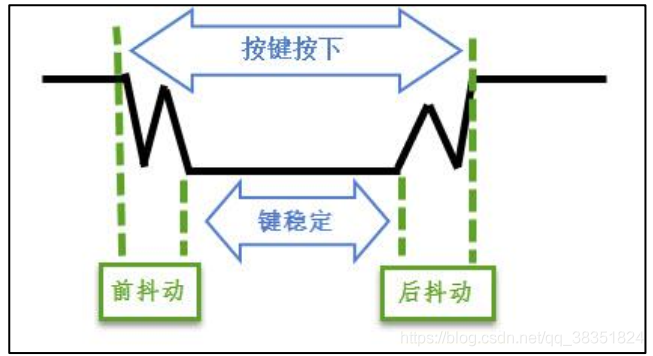

# 第一章 认识单片机-GPIO，按键与LED

## 如何点亮一个LED

发光二极管简称为LED，符号如下图所示。


与普通二极管一样由一个PN结组成，具有单向导电性。当给发光二极管加上正向电压后，二极管导通发出不同颜色的可见光，二极管正向伏安特性曲线很陡，使用时必须串联限流电阻以控制通过二极管的电流。


## 如何控制LED的亮度

LED的控制模式有恒流和恒压两种，有多种调光方式，比如模拟调光和PWM调光，大多数的LED都采用的是恒流控制，这样可以保持LED电流的稳定，不易受VF的变化，可以延长LED灯具的使用寿命。但是在单片机中一般使用PWM调光，即控制LED电压的导通与关闭之间的比例来调节亮度，为了避免闪频现象PWM脉冲的频率必须大于100Hz。

PWM调光原理图如下图所示：


## LED的GPIO配置

单片机除了内部的控制器外，用户看到的管脚主要是留出的不同外设接口，GPIO属于最基本的外设，通过寄存器的不同配置可作为输入或输出。GPIO功能的选择是通过寄存器来实现的，其接口电路如下图所示：


知道了GPIO的内部结构，那么配置IO口的输出功能是如何实现的呢？实际上单片机内部针对不同外设都有很多寄存器，这些寄存器的地址与芯片的内存地址和Flash地址使用相关的地址空间，并且官方提供了良好的库文件方便用户使用。要想通过寄存器配置端口电平，首先需要了解有哪些相关寄存器。

### GPIO_TypeDef

每组IO口都有一个结构体，这个结构体实际上对应的是配置寄存器中的某几个寄存器。

``` c
// stm32f405xx.h line 427
/** 
  * @brief General Purpose I/O
  */

typedef struct
{
  __IO uint32_t MODER;    /*!< GPIO port mode register,               Address offset: 0x00      */
  __IO uint32_t OTYPER;   /*!< GPIO port output type register,        Address offset: 0x04      */
  __IO uint32_t OSPEEDR;  /*!< GPIO port output speed register,       Address offset: 0x08      */
  __IO uint32_t PUPDR;    /*!< GPIO port pull-up/pull-down register,  Address offset: 0x0C      */
  __IO uint32_t IDR;      /*!< GPIO port input data register,         Address offset: 0x10      */
  __IO uint32_t ODR;      /*!< GPIO port output data register,        Address offset: 0x14      */
  __IO uint32_t BSRR;     /*!< GPIO port bit set/reset register,      Address offset: 0x18      */
  __IO uint32_t LCKR;     /*!< GPIO port configuration lock register, Address offset: 0x1C      */
  __IO uint32_t AFR[2];   /*!< GPIO alternate function registers,     Address offset: 0x20-0x24 */
} GPIO_TypeDef;
```

``` c
// stm32f405xx.h line 885
/*!< AHB1 peripherals */
#define GPIOA_BASE            (AHB1PERIPH_BASE + 0x0000UL)
#define GPIOB_BASE            (AHB1PERIPH_BASE + 0x0400UL)
#define GPIOC_BASE            (AHB1PERIPH_BASE + 0x0800UL)
#define GPIOD_BASE            (AHB1PERIPH_BASE + 0x0C00UL)
#define GPIOE_BASE            (AHB1PERIPH_BASE + 0x1000UL)
#define GPIOF_BASE            (AHB1PERIPH_BASE + 0x1400UL)
#define GPIOG_BASE            (AHB1PERIPH_BASE + 0x1800UL)
#define GPIOH_BASE            (AHB1PERIPH_BASE + 0x1C00UL)
#define GPIOI_BASE            (AHB1PERIPH_BASE + 0x2000UL)

// stm32f405xx.h line 1001
#define GPIOA               ((GPIO_TypeDef *) GPIOA_BASE)
#define GPIOB               ((GPIO_TypeDef *) GPIOB_BASE)
#define GPIOC               ((GPIO_TypeDef *) GPIOC_BASE)
#define GPIOD               ((GPIO_TypeDef *) GPIOD_BASE)
#define GPIOE               ((GPIO_TypeDef *) GPIOE_BASE)
#define GPIOF               ((GPIO_TypeDef *) GPIOF_BASE)
#define GPIOG               ((GPIO_TypeDef *) GPIOG_BASE)
#define GPIOH               ((GPIO_TypeDef *) GPIOH_BASE)
#define GPIOI               ((GPIO_TypeDef *) GPIOI_BASE)

// stm32f405xx.h line 832
#define APB1PERIPH_BASE       PERIPH_BASE
#define APB2PERIPH_BASE       (PERIPH_BASE + 0x00010000UL)
#define AHB1PERIPH_BASE       (PERIPH_BASE + 0x00020000UL)
#define AHB2PERIPH_BASE       (PERIPH_BASE + 0x10000000UL)

// stm32f405xx.h line 815
#define PERIPH_BASE           0x40000000UL /*!< Peripheral base address in the alias region 
```

根据代码段可了解到，可通过`GPIOA->MODER`访问到`MODER`配置寄存器。在stm32f4xx.h文件中定义了一些访问寄存器的函数如下：

```c
// stm32f4xx.h line 209
/** @addtogroup Exported_macro
  * @{
  */
#define SET_BIT(REG, BIT)     ((REG) |= (BIT))

#define CLEAR_BIT(REG, BIT)   ((REG) &= ~(BIT))

#define READ_BIT(REG, BIT)    ((REG) & (BIT))

#define CLEAR_REG(REG)        ((REG) = (0x0))

#define WRITE_REG(REG, VAL)   ((REG) = (VAL))

#define READ_REG(REG)         ((REG))

#define MODIFY_REG(REG, CLEARMASK, SETMASK)  WRITE_REG((REG), (((READ_REG(REG)) & (~(CLEARMASK))) | (SETMASK)))

#define POSITION_VAL(VAL)     (__CLZ(__RBIT(VAL))) 
```
通过这些函数可很方便地访问到各寄存器的内容。

对GPIO的内部结构有一定了解后，我们就可以尝试配置`PA15`来作为LED的输出。其类中顺序参考`GPIO_TypeDef`。

### MODER-GPIO模式

MODER 中包含 0-15 号引脚，每个引脚占用 2 个寄存器位。其含义如下：

* 00：输入（默认）
* 01：通用输出模式
* 10：复用功能模式
* 11：模拟功能模式

所选IO为PA15，所以可配置如下：

```c
/* PA15 MODER15 清空*/
CLEAR_BIT(GPIOA->MODER, 3<<2*15);
/* PA15 MODER15 = 01b 输出模式*/
SET_BIT(GPIOA->MODER, 1<<2*15);
```

此处`SET_BIT`函数实际上使用的是`|=`的置位操作，在单片机中这样的位操作十分常见，另外还有`&=`置零操作。

### OTYPER-输出类型

GPIO的输出有2种类型：推挽输出和开漏输出。其中开漏输出常用于I2C之类线路中，形成线与电路，需要外部上拉才能输出高电平。在LED电路中需要配置成推挽输出才能控制IO口为高电平或为低电平。

```c
/* PA15 OTYPER15 清空 */
CLEAR_BIT(GPIOA->OTYPER, ~(1<<1*15));
/* PA15 OTYPER15 = 0b 推挽模式*/
SET_BIT(GPIOA->OTYPER, 0<<(1*15));
```

### OSPEEDR-输出速度

GPIO 引脚的输出速度是引脚支持高低电平切换的最高频率，暂不设置使用默认值。

* 00：2MHz
* 01：25MHz
* 10：50MHz
* 11：100MHz

### PUPDR-上下拉模式

当 GPIO 引脚用于输入时，引脚的上/下拉模式可以控制引脚的默认状态。当用于输出时电平受控与OCR寄存器。不过此处仍可配置为上拉用于提供电流输出能力。

* 00：无上拉，无下拉
* 01：上拉
* 10：下拉
* 11：保留

```c
/*PA15 PUPDR15 清空*/
CLEAR_BIT(GPIOA->PUPDR, 3<<2*15);
/*PA15 PUPDR15 = 01b 上拉模式*/
SET_BIT(GPIOA->GPIOH_PUPDR, 1<<(2*15));

```

### IDR-输入

此寄存器用于读取GPIO作为输入时的电平。

### ODR与BSRR

ODR和BSRR均可控制GPIO的输出电平，ODR为读写寄存器，BSRR为只写寄存器。两者在控制GPIO时的主要区别是，用BSRR去改变管脚状态的时候，没有被中断打断的风险，不需要关中断。所以控制GPIO的状态最好还是用BSRR。

BSRR的高16位称作清除寄存器，用于配置IO口为低电平。而BSRR的低16位称作设置寄存器，用于配置IO口为高电平。这里用到WRITE_REG函数用于寄存器写入。
相关代码写作：

```c
/* PA15 BSRR 寄存器高16位的 BR15 置 1，使引脚输出低电平*/
WRITE_REG(GPIOA->BSRR, 1<<16<<15);

/* PA15 BSRR 寄存器低16位的 BS15 置 1，使引脚输出高电平*/
WRITE_REG(GPIOA->BSRR, 1<<(15));
```

### LCKR

IO口功能锁定，如果端口状态锁定，那么设备下次复位前将保持当前状态，可用于放置误操作对当前配置的修改。

### AFR[2]

GPIO复用做I2C、UART、SPI等接口时会用到，此处暂不讨论。后续使用时通过cubemx自动完成配置。

## gpio_init

根据以上对GPIO口的分析可完成gpio_init函数如下：

``` C
void gpio_init(void)
{
    /* PA15 MODER15 清空 */
    CLEAR_BIT(GPIOA->MODER, 3<<2*15);
    /* PA15 MODER15 = 01b 输出模式*/
    SET_BIT(GPIOA->MODER, 1<<2*15);

    /* PA15 OTYPER15 清空 */
    CLEAR_BIT(GPIOA->OTYPER, 1<<1*15);
    /* PA15 OTYPER15 = 0b 推挽模式*/
    SET_BIT(GPIOA->OTYPER, 0<<(1*15));

    /*PA15 PUPDR15 清空 */
    CLEAR_BIT(GPIOA->PUPDR, 3<<2*15);
    /*PA15 PUPDR15 = 01b 上拉模式 */
    SET_BIT(GPIOA->PUPDR, 1<<(2*15));

    /* PA15 BSRR 寄存器低16位的 BS15 置 1，使引脚输出高电平 */
    /* 默认点亮LED */
    WRITE_REG(GPIOA->BSRR, 1<<(15));
}
```

注意：用户代码应添加到`Begin`和`End`之间，如：

``` C
/* USER CODE BEGIN 4 */
/* USER CODE END 4 */
```

### 外设时钟

如上配置完成后LED灯并没有被点亮，为什么？

嵌入式芯片中为了降低功耗，上电时默认外设是不提供控制时钟。为了使能外设，需使能相应外设的时钟。GPIO 都挂载到 AHB1 总线上，所以它们的时钟由 AHB1 外设时钟使能寄存器(RCC_AHB1ENR)来控制，其中 GPIOA 端口的时钟由该寄存器的位 0 写 1 使能。

```c
/* GPIOA端口时钟使能 */
SET_BIT(RCC->AHB1ENR, 1<<0);
```

需增加此行代码到`gpio_init()`函数中去。

## 按键检测

按键检测与LED控制类似，都是GPIO外设类型，区别在于1个是输入，1个是输出。IO状态的读取可用READ_BIT实现。按键输入为PB3，按键按下时输入为低，外部无上拉。
电路如下图：


### 增加按键后的gpio_init

与led类似，此处只需要配置GPIO为输入即可。

```c
  /*******************************
   * GPIO PB3 按键输入
   *******************************/
  /* GPIOB端口时钟使能 */
  SET_BIT(RCC->AHB1ENR, 1<<1);

  /* PB3 MODER3 清空 */
  CLEAR_BIT(GPIOB->MODER, 3<<2*3);
  /* PB3 MODER3 = 00b 输入模式*/
  SET_BIT(GPIOB->MODER, 0<<2*3);

  /*PB3 PUPDR3 清空 */
  CLEAR_BIT(GPIOB->PUPDR, 3<<2*3);
  /*PB3 PUPDR3 = 01b 上拉模式 */
  SET_BIT(GPIOB->PUPDR, 1<<(2*3));
```

### key_scan

此处只实现简单的IO电平读取，不做按键防抖和边沿检测。

```c
uint8_t key_scan(void)
{
  static uint32_t lastValue = 0;
  uint32_t curValue = 0;

  if((GPIOB->IDR & (1<<3>>))) != (uint32_t)GPIO_PIN_RESET)
  {
    curValue = GPIO_PIN_SET;
  }
  else
  {
    curValue = GPIO_PIN_RESET;
  }

  //curValue = HAL_GPIO_ReadPin(USR_KEY_GPIO_Port, USR_KEY_Pin);

  if (curValue != lastValue)
  {
      lastValue = curValue;

      if (curValue == 0)
          return 1;                       // active
  }
  return 0;                               // not active
}
```

HAL库函数版本：

```c
uint8_t key_scan(void)
{
  static uint32_t lastValue = 0;
  uint32_t curValue = 0;

  curValue = HAL_GPIO_ReadPin(USR_KEY_GPIO_Port, USR_KEY_Pin);

  if (curValue != lastValue)
  {
      lastValue = curValue;

      if (curValue == 0)
          return 1;                       // active
  }
  return 0;                               // not active
}
```

### 按键防抖动



## STM32CubeMX与HAL库

HAL(Hardware Abstraction Layer)库是在标准库的基础上进行了抽象、封装。在此库基础上的开发应用程序可在STM32不同产品之间快速移植，同时此库也引入了第三方中间件，如RTOS，USB，TCP/IP和图形库等。

STM32CubeMx是ST提供的硬件配置图形化工具，可方便的配置不同IO的功能，以及外设的配置。完成配置后可自动生成基于HAL库的代码工程，并且自动生产外设初始化函数，使用户可把更多精力放在应用层的代码设计。

常用的HAL库函数：

* 延时函数：HAL_GetTick(), HAL_Delay() 单位ms
* GPIO函数：HAL_GPIO_ReadPin(), HAL_GPIO_WritePin(), HAL_GPIO_TogglePin(), HAL_GPIO_EXTI_Callback()
* UART函数：HAL_UART_Transmit(), HAL_UART_Receive(), HAL_UART_Transmit_IT(), HAL_UART_Receive_IT(), HAL_UART_Transmit_DMA(), HAL_UART_Receive_DMA
* UART中断函数：HAL_UART_TxHalfCpltCallback(), HAL_UART_TxCpltCallback(), HAL_UART_RxHalfCpltCallback(), HAL_UART_RxCpltCallback(), HAL_UART_ErrorCallback()
* ADC函数：HAL_ADC_Start(), HAL_ADC_PollForConversion(), HAL_ADC_GetValue(), HAL_ADC_Stop()
* SPI函数：HAL_SPI_Transmit(), HAL_SPI_Receive(), HAL_SPI_TransmitReceive()
* I2C函数：HAL_I2C_Master_Transmit(), HAL_I2C_Master_Receive(), HAL_I2C_Slave_Transmit(), HAL_I2C_Slave_Receive(), HAL_I2C_Mem_Write(), HAL_I2C_Mem_Read()

### LED流水灯-cubemx配置

cubemx中GPIO配置，PA13为输出，重命名为`LED_RED`。自动生成的代码中的`MX_GPIO_Init()`函数会对PA3口进行配置，配置参数与cubemx中所选项一致。
具体配置如图：


时钟配置如图：


### LED自动闪烁

使用HAL_Delay函数和HAL_GPIO_TogglePin函数可轻松实现LED闪烁功能。`LED_RED_GPIO_Port`和`LED_RED_Pin`宏定义自动生成，并存放在main.h中。

```c
while(1)
{
  HAL_GPIO_TogglePin(LED_RED_GPIO_Port, LED_RED_Pin);
  HAL_Delay(1000); // ms
}
```

## 作业1

使用HAL库函数利用按键检测函数实现4个LED计数器方式亮灭。

* 第一次：1个灯亮
* 第二次：2个灯亮
* 第三次：3个灯亮
* 第四次：4个灯亮
* 第五次：0个灯亮

## 作业2

使用HAL库函数利用延时函数实现4个LED计数器方式亮灭。

* 第一次：1个灯亮
* 第二次：2个灯亮
* 第三次：3个灯亮
* 第四次：4个灯亮
* 第五次：0个灯亮

## 参考

[百度百科-LED](https://baike.baidu.com/item/%E5%8F%91%E5%85%89%E4%BA%8C%E6%9E%81%E7%AE%A1/1521536?fromtitle=LED&fromid=956234&fr=aladdin)
[百度百科-LED驱动电源](https://baike.baidu.com/item/LED%E9%A9%B1%E5%8A%A8%E7%94%B5%E6%BA%90/7758101)
[寄存器点亮 LED](https://blog.csdn.net/qq_38351824/article/details/89672214)
[STM32 HAL 常用库函数文档](https://www.z10.xin/archives/1188)