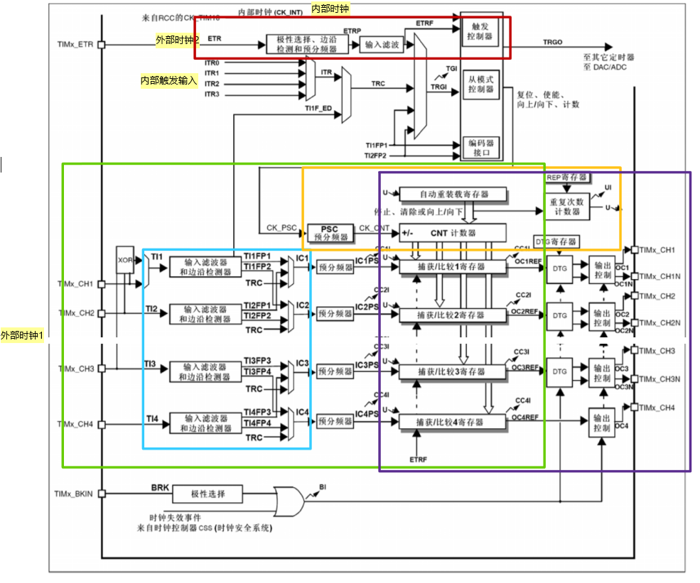
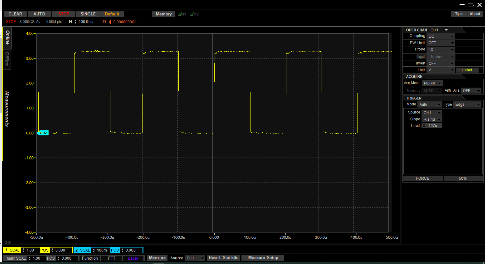
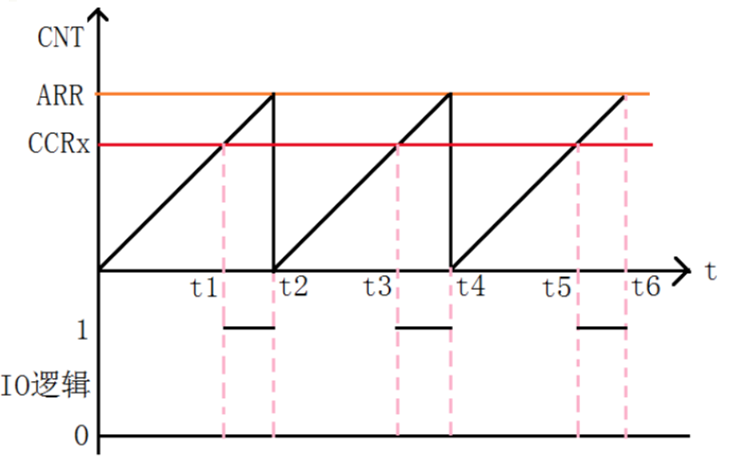

# 第二章 认识单片机-定时器

使用PWM控制LED亮度，进一步实现呼吸灯功能。

## 时间管理

单片机中的延时函数一般是在一个循环中一直等待，如果延时时间很长则会影响其他任务，例如如果控制LED闪烁周期是2秒，那么同时检测按键的话则会发生不能正常捕捉的现象。这个问题本质上在MCU内部是处理器资源的浪费所导致的，这里所说的资源和计算机中CPU利用率类似，当程序在延时函数中时，独自占用MCU不能执行其他任务(中断除外)，从而形成浪费。

那么是否可以在需要延时执行的时候设定一个闹钟，当闹钟响的时候再去处理某件事情，闹钟设定时间未到时就可以执行其他任务从而提高处理器的效率。答案当然是可以的。在单片机中这个闹钟是`定时器`。

## 定时器

定时器的实现方法基本是对特定频率进行计数，并与某个设定的时间值进行比较，当计数值与设定值相同是触发中断。单片机内部的定时器框图如下：

由图可看出定时器包括：

* 时钟源选择：内部时钟/外部时钟
* 时基单元：对时钟源进行预分频得到计数时钟，并把时钟给到计数器，计数到设定值时自动重载。
* 输入捕获：包含输入通道选择，脉冲捕获，预分频，最后送给捕获/比较寄存器。此通道可用于脉宽测量和频率测算
* 输出比较：当计数器的值与比较寄存器的值相同时输出信号发送跳变。

## 定时器用途

* 配置定时器可实现特定周期的中断，通过中断中计数法计时，或直接周期性触发特定事件，如ADC/DAC
* 利用输入捕获功能实现脉冲计数器，如统计特定时间内按键被按下次数，或某脉冲发送次数，也可以计算某脉冲信号频率或占空比
* 利用脉输出比较器实现脉冲发生器，如产生PWM波或特定频率的方波。
* 定时器产生的中断计时器也可以用于实现周期性执行特定任务。

## 定时器分类

STM32的定时器有：高级定时器、普通定时器、基本定时器、看门狗定时器、系统嘀嗒定时器。其中嘀嗒定时器就是上面使用的`SysTick`。不同的定时器的功能也不完全相同，主要体现在计数器方向（计数方式：递增、递减、递增递减），是否支持捕获/比较功能，是否支持互补输出。

* 高级定时器：全功能,timer1和timer8
* 普通定时器：不支持互补输出（同时控制2个IO口输出，主要用于控制电机运动），timer2-5，timer9-14
* 基本定时器：不支持互补输出，不支持捕获/比较，只支持向上计数，timer6和timer7

看门狗定时器是用于防止程序异常发生时触发系统复位用的，启用看门狗后需要在定时时间到之前重置计数器（此动作称作喂狗），如果不能及时喂狗，则定时器将触发系统复位。

## 用PWM波控制LED亮度

在第一章中提到LED的亮度与流过的电流或LED两端电压有关。在单片机中实际是通过PWM波来控制LED亮度的，其等效为电流的有效值的变化，同时也考虑了人眼视觉残留的问题。为了保证有良好的视觉效果，需要确保PWM信号的频率不小于100Hz，即周期最大10ms。

HAL库为我们提供了延时相关函数`HAL_GetTick()`和`HAL_Delay()`，但是Delay函数的单位是毫秒，不能满足需求。但我们可以直接调用SysTick获取计数值并利用计数值进行延时。

```c
// ref core_cm4.h line 756
/**
  \brief  Structure type to access the System Timer (SysTick).
 */
typedef struct
{
  __IOM uint32_t CTRL;                   /*!< Offset: 0x000 (R/W)  SysTick Control and Status Register */
  __IOM uint32_t LOAD;                   /*!< Offset: 0x004 (R/W)  SysTick Reload Value Register */
  __IOM uint32_t VAL;                    /*!< Offset: 0x008 (R/W)  SysTick Current Value Register */
  __IM  uint32_t CALIB;                  /*!< Offset: 0x00C (R/ )  SysTick Calibration Register */
} SysTick_Type;
```

根据`SysTick_Type`数据结构，我们可以设计微妙级延时函数。用于SysTick计数的时钟是在STM32CUBEMX中的Clock中配置的，如下图：


图中预分频可选择8分频或1分频，默认是1分频。在执行函数`SystemCoreClockUpdate`时会更新`SysTick_Type`的`LOAD`值。代码段如下，其中`SystemCoreClock`即上图中的`To Cortex System Timer`

```c
  // stm32f4xx_hal.c line 255
  /* Configure the SysTick to have interrupt in 1ms time basis*/
  if (HAL_SYSTICK_Config(SystemCoreClock / (1000U / uwTickFreq)) > 0U)
  {
    return HAL_ERROR;
  }

  // stm32f4xx_hal.c line 229
  uint32_t HAL_SYSTICK_Config(uint32_t TicksNumb)
  {
    return SysTick_Config(TicksNumb);
  }

  // cor_cm4.h line 2022
__STATIC_INLINE uint32_t SysTick_Config(uint32_t ticks)
{
  if ((ticks - 1UL) > SysTick_LOAD_RELOAD_Msk)
  {
    return (1UL);                                                   /* Reload value impossible */
  }

  SysTick->LOAD  = (uint32_t)(ticks - 1UL);                         /* set reload register */
  NVIC_SetPriority (SysTick_IRQn, (1UL << __NVIC_PRIO_BITS) - 1UL); /* set Priority for Systick Interrupt */
  SysTick->VAL   = 0UL;                                             /* Load the SysTick Counter Value */
  SysTick->CTRL  = SysTick_CTRL_CLKSOURCE_Msk |
                   SysTick_CTRL_TICKINT_Msk   |
                   SysTick_CTRL_ENABLE_Msk;                         /* Enable SysTick IRQ and SysTick Timer */
  return (0UL);                                                     /* Function successful */
}
```

计算：LOAD = 168000000/(1000 / 1) = 168000。其中`uwTickFreq`为1。完成一个计数循环为1ms。

据此设计微妙量级定时器。

``` c
void delay_us(uint32_t us_delay)
{
    uint32_t startValue, tickn, cnts, wait;

    startValue = SysTick->VAL;          // 记录当前计数器计数值，此计数为减计数
    tickn = HAL_GetTick();              // 记录当前tick计数值
    cnts = us_delay * (168);            // 168个计数为1us

    if (cnts > startValue)
    {
        while(HAL_GetTick() == tickn)   // 等待当前计数周期结束
        {
            ;
        }
        cnts = cnts - startValue;       // 完成当前计数周期后cnts值减

        tickn = HAL_GetTick();          // 更新tick计数值
        while(cnts > 168000)            // 等待完成大于1ms的延时
        {
            while(HAL_GetTick() == tickn) {;}

            tickn = HAL_GetTick();      // 更新tick计数值
            cnts = cnts - 168000;
        }

        if (cnts > 0)
        {
            startValue = SysTick->VAL; // 记录当前计数器计数值，此计数为减计数
            wait = 16800 + startValue - cnts;   // 计算等待计数结束值
            while(wait < SysTick->VAL) {;}      // 等待计数结束
        }

    }else
    {
        wait = startValue - cnts;       // 计算等待计数结束值
        while(wait < SysTick->VAL && HAL_GetTick() == tickn) {;} // 等待计数结束
    }
}
````

注意：此处使用`while(){;}` 而不是`while();`是为了防止出现`while();{}`错误。

### 用延时函数实现PWM

利用第一章的`key_scan`函数修改变量`state`

```c
    // copy the code to while(1){}
    if (key_scan() > 0)
    {
        state += 1;
        if (state > 5)
            state = 0;
    }
```

让后根据`state`的值执行不同时间的延时，执行延时的同时改变LED的状态。

```c
switch (state)
{
    case 0:
        delay_us(100);          //100us
        break;
    case 1:
        delay_us(1000);         // 1ms
        break;
    case 2:
        delay_us(10000);        // 10ms
        break;
    case 3:
        delay_us(100000);       // 100ms
        break;
    case 4:
        HAL_Delay(1000);        // 1s
        break;
    default: break;
}

    HAL_GPIO_TogglePin(LED_GRN_GPIO_Port, LED_GRN_Pin);
```

使用示波器测量波形可看到100us时的周期基本与设定值一致，如下图测得100us间隔时的波形，可以看出时间与延时值基本一致，实际测量周期为201.7us。



### 用定时器实现PWM

此处选择普通定时器Timer3来实现PWM控制LED亮度。对定时器的配置只需要在cubemx中进行简单的参数设置即可，初始化函数会自动生成。

STM32F405中TIM1,TIM8-11的时钟源为APB2，TIM2-7,TIM12-14的时钟源为APB1, 参考上文时钟配置可知道APB2_timer_clock = 168MHz，APB1_timer_clock = 84MHz。所选Timer3的时钟为84MHz。

定时器的PWM原理如下图：



其原理是当CNT计数值小于CCRx时输出0，大于等于CCRx时输出1，频率一定时改变CCRx即可改变占空比。改变ARR可改变PWM的频率

在cubemx中的配置界面如下图所示：


配置PWM周期为：84MHz/8400/100 = 100Hz，这里的100即为计数周期。

然后通过函数`__HAL_TIM_SET_COMPARE`可实现占空比的配置。设计函数`setTimer3PwmDutycycle`用于配置占空比：

```c
// tim.c line 134
void setTimer3PwmDutycycle(uint8_t dutycycle)
{
    __HAL_TIM_SET_COMPARE(&htim3, TIM_CHANNEL_1, dutycycle);
}
```

为了配合按键控制PWM占空比，设计按键处理函数`key_handle_pwm`:

```c
// main.c line 186
void key_handle_pwm(void)
{
    static uint8_t dutycycle = 0;

    if (dutycycle < 100 )
    {
        dutycycle += 10;
    }else
    {
        dutycycle = 0;
    }

    setTimer3PwmDutycycle( dutycycle );
}
```

程序烧录后可通过`USR_KEY`逐级控制LED的亮度。

测量LED控制端口的PWM波形如下图：


## 作业1

用延时函数和PWM定时器实现呼吸灯功能。

## 作业2

用按键速度控制LED亮度。

## 参考

[STM32 Timer (1) 定时器分类和框图](https://www.cnblogs.com/kmist/p/11669232.html)
[stm32f103高级定时器功能框图笔记](https://www.cnblogs.com/thefuck/p/13567854.html)
[STM32CubeIDE HAL库微秒us的延时Delay实现](https://blog.csdn.net/u010779035/article/details/104102469?utm_medium=distribute.pc_relevant.none-task-blog-BlogCommendFromMachineLearnPai2-3.nonecase&depth_1-utm_source=distribute.pc_relevant.none-task-blog-BlogCommendFromMachineLearnPai2-3.nonecase)

## tips

[设置Eclipse中的tab键为4个空格的完整方法:](https://www.cnblogs.com/jhj117/p/6121405.html)

* 点击 window->preference-,依次选择 General->Editors->Text Editors,选中右侧的 insert space for tabs;
* window->preference-,依次选择 java（或C++）->code style ->formatter,点击右侧的editor，选则左侧 tab policy的值为spaces only。此步骤可能需要new一个新的配置。
