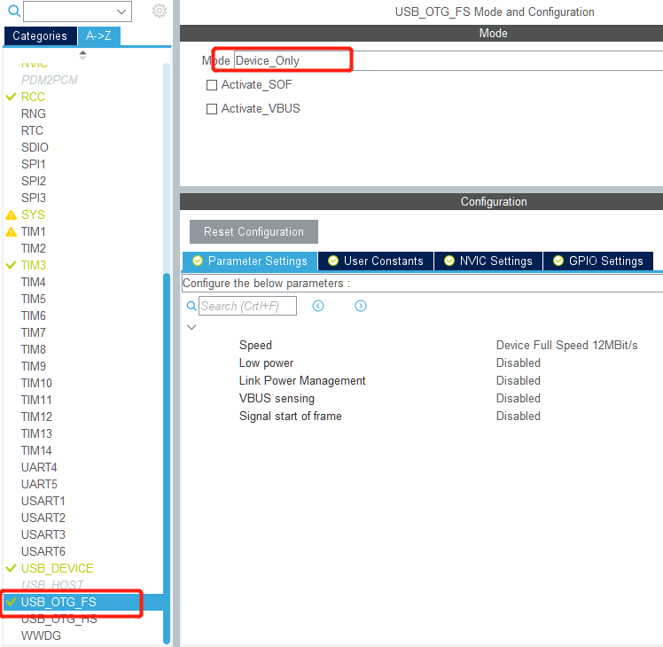
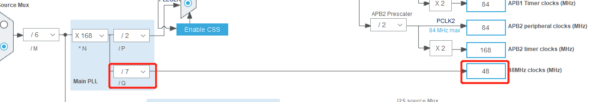
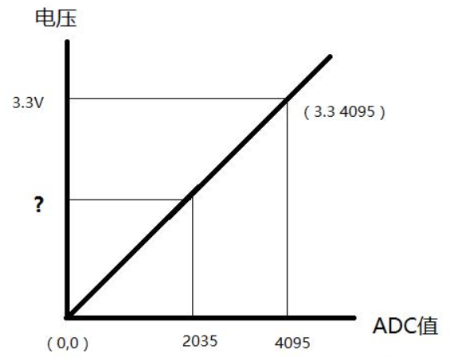
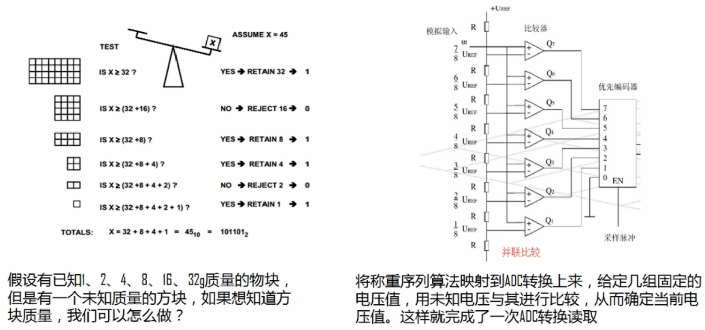
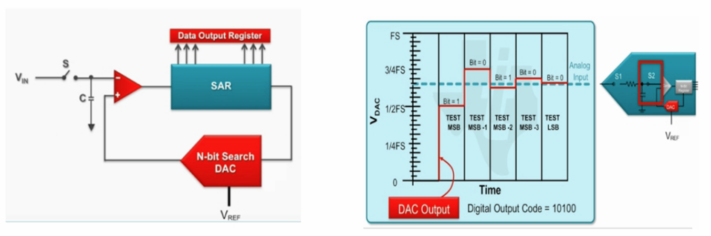
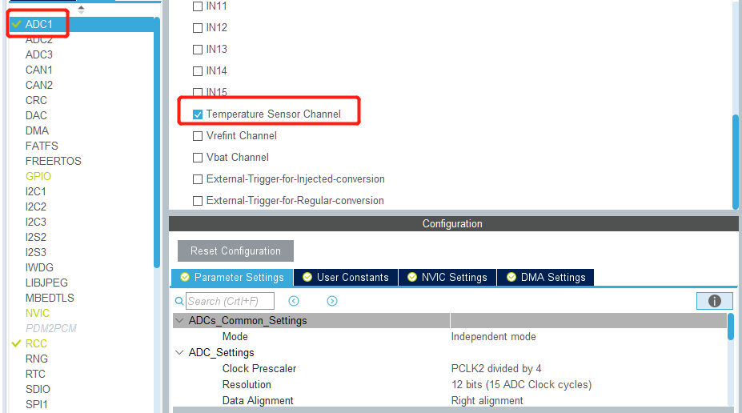
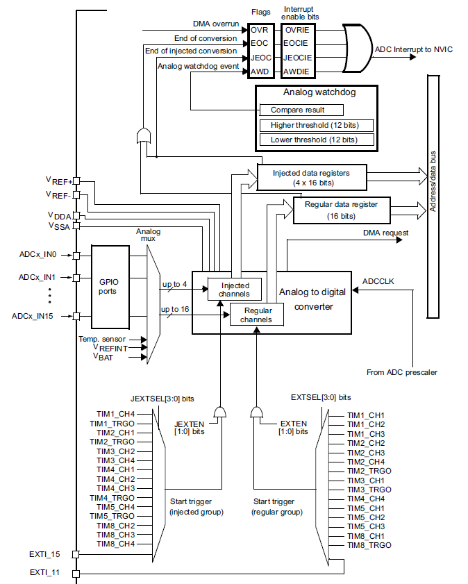
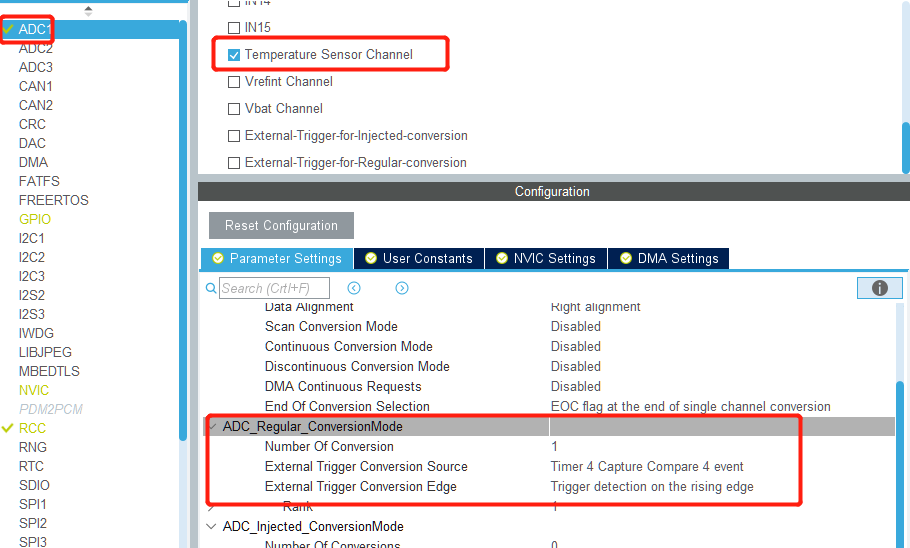

# 第三章 常用外设

定时获取ADC数据，并通过串口打印输出。

## 单片机的组成

单片机是将中央处理器(CPU)、随机存储器(RAM)、只读存储器(ROM)、多种I/O接口和中断系统、定时器/计数器等功能（包括显示器驱动、脉宽调制、ADC、DAC、串口控制器、SPI控制器、I2C控制器等）集成到一个芯片上形成的小而完善的微型计算机系统。

CPU部分包含运算器和控制器。其中运算器又主要包括算数逻辑单元、累加器和寄存器，用于完成各种算数运算和逻辑运算。控制器又由程序计数器、指令寄存器、指令译码器、时序发生器和操作控制器等组成，主要用于从内存中取指令并执行相应动作。单片机内部通过总线把运算器和控制器的相关模块互连起来，并通过外部总线与外部的接口电路互连。

## 单片机系统常用外设

### 片上外设

单片机内部外设包括：串口控制器，SPI，I2C，ADC，DAC，PWM，CAN，定时器，GPIO等，控制器均集成在单片机内部

### 外部设备

外部设备指单片机系统中片外的功能模块，如按键驱动芯片，LCD，ADC芯片、加速度传感器、音频控制器等等，外部设备通过特定总线(I2C，SPI，I2S)与单片机互连通信。

## USB虚拟串口

为了使单片机与PC进行通信可采用两种方法：PC通过USB转串口与单片机上的USART接口对接完成通信，单片机与PC通过USB进行通信，在PC端虚拟出1个串口。此处单片机就采用虚拟串口的方式与PC进行通信。

### cubemx配置

**USB配置：**



在Pinout中配置USB_OTG_FS为`Device_only`模式。然后`USB_DEVICE`选项将有效，在此选项中配置Class For FS IP为`Virtual Port Com`。

**时钟配置：**

USB通信协议和兼容性的一些原因需要给USB控制器提供48MHz的时钟频率以保证数据传输质量，体配置如下：



**堆栈配置：**

在`Project Manager`页面的`Project`中修改Linker Settings->Minimum Heap Size为0x800，即配置为3KB。

### usb+printf函数

USB接口向外发送数据是通过`CDC_Transmit_FS`函数实现的，常规的printf最终会调用fputc函数完成单个字节的发送，但是USB传输是包含有底层协议和多次交互的单个字节的发送会降低效率，所以可重新定义printf函数并重命名为`usb_printf`，此函数等价于printf函数，不同之处在于前者将待发送数据存入缓冲区后一次性把数据发送到接收端，从而提高了数据传输效率。

在usbd_cdc_if.c里面末尾USER CODE BEGIN及USER CODE END之间添加如下代码：

```c
// STM32CubeIDE USB_DEVICE/App/usbd_cdc_if.c line 319
#include <stdarg.h>
void usb_printf(const char *format, ...)
{
    va_list args;
    uint32_t length;

    va_start(args, format);
    length = vsnprintf((char *)UserTxBufferFS, APP_TX_DATA_SIZE, (char *)format, args);
    va_end(args);
    CDC_Transmit_FS(UserTxBufferFS, length);
}
```

增加头文件：

```c
// usbd_cdc_if.h
/* USER CODE BEGIN EXPORTED_FUNCTIONS */
void usb_printf(const char *format, ...);
/* USER CODE END EXPORTED_FUNCTIONS */
```

然后就可以在main函数中使用usb_printf函数了，可在每次按键按下时发送当前的按键计数值。但是当尝试连续2次调用usb_printf函数时会发现第二次数据不能正常发送，为解决这个问题我们在`CDC_Transmit_FS`函数中增加状态判断，当数据完全发送或超时时退出。

```c
// usbd_cdc_if.c line 282
uint8_t CDC_Transmit_FS(uint8_t* Buf, uint16_t Len)
{
    uint8_t result = USBD_OK;
    /* USER CODE BEGIN 7 */
    uint16_t retry = 0;

    USBD_CDC_HandleTypeDef *hcdc = (USBD_CDC_HandleTypeDef*)hUsbDeviceFS.pClassData;
    if (hcdc->TxState != 0){
        return USBD_BUSY;
    }
    USBD_CDC_SetTxBuffer(&hUsbDeviceFS, Buf, Len);
    result = USBD_CDC_TransmitPacket(&hUsbDeviceFS);

    while(hcdc->TxState == 1)
    {
        retry++;
        if(retry == 0xfff0)
        {
            return USBD_FAIL;
        }
    }
    /* USER CODE END 7 */
    return result;
}
```

### 数据接收

常规的串口数据收发是可以发十六进制和字符串都没问题的，USB数据收发本质上也没问题，但是为了简单接收和发送都采用了字符串方式，以`\r\n`作为结束符。其中具体原因稍后在做讨论。

USB数据传输是分包发送的每包最长64字节，要想接收不同长度的数据，就需要对不同数据进行组包。所以我们设计数据结构如下：

```c
// usbd_cdc_if.c line 54
/* USER CODE BEGIN PRIVATE_TYPES */
typedef struct  
{  
   uint8_t   OutFlag;  // 完成数据接收标识符
   uint8_t   EFlag[2]; // 数据结束标志
   uint8_t   SFlag;
   uint16_t  ReLen;    // 数据长度
}USB_Dev;
/* USER CODE END PRIVATE_TYPES */

```

然后定义结构体变量并初始化，其中`0x0D`和`0x0A`分别对应`\r`和`\n`：

```c
/* USER CODE BEGIN PRIVATE_VARIABLES */
USB_Dev  USB_S =
{
    0,
    {0x0D,0x0A},
    0,
    0,
};
/* USER CODE END PRIVATE_VARIABLES */
```

数据的接收处理是通过`CDC_Receive_FS`调用的，此函数在USB接收到数据后被调用。为了完成数据的拼包，可在此函数中修改下次数据的接收位置，并检测最后2个数据是否与`EFlag`一致。

```c
static int8_t CDC_Receive_FS(uint8_t* Buf, uint32_t *Len)
{
    //将已接收数据长度赋值给USB_S.ReLen
    USB_S.ReLen += *Len;

    //判断是否有结束标志以及接收数据长度是否达到UserRxBufferFS长度上限
    if( USB_S.ReLen < APP_RX_DATA_SIZE && \
        UserRxBufferFS[USB_S.ReLen-2] != USB_S.EFlag[0] && \
        UserRxBufferFS[USB_S.ReLen-1] != USB_S.EFlag[1]
        )
    {
        //设置下一次接收数据的位置
        USBD_CDC_SetRxBuffer(&hUsbDeviceFS, UserRxBufferFS + USB_S.ReLen);
        USBD_CDC_ReceivePacket(&hUsbDeviceFS);   //准备接收数据
    }
    else  //长度达到，或者检测到标志位,触发数据输出
    {
        USB_S.OutFlag = 1;
    }

    return (USBD_OK);
}
```

在主函数中判断`OutFlag`即可知道USB是否接收到完整数据。为了不占用中断处理时间数据数据在main函数的while(1)中调用。因此定义函数`tryHandleUsbData`：

```c
// usbd_cdc_if.c
void tryHandleUsbData(void)
{
    if (USB_S.OutFlag == 1)
    {
        // 数据处理
        // todo
        CDC_Transmit_FS(UserRxBufferFS, USB_S.ReLen);

        // 重新开始接收数据
        USB_S.ReLen = 0;
        USB_S.OutFlag = 0;
        //设置下一次接收数据的位置
        USBD_CDC_SetRxBuffer(&hUsbDeviceFS, UserRxBufferFS + USB_S.ReLen);
        USBD_CDC_ReceivePacket(&hUsbDeviceFS);   //准备接收数据
    }
}

// usbd_cdc_if.h
void tryHandleUsbData(void);
```

### 串口通信协议

上节数据接收中使用`\r\n`表示数据发送完成，这本质上就是一种通信协议。因为串口数据是数据流形式发送的，接收端进行数据解析时需要知道数据从哪里开始，到哪里结束。发送字符串时可通过`\r\n`标志，因为这2个字符在数据流中唯一的，一般不会出现用户数据字段出现这样的字符。但是如果发送的是十六进制数，那么问题就变得复杂了，这时候就需要使用更为复杂的通信协议，目的是解决用户数据从哪里开始，数据长度多少，到哪里结束，如何验证数据是否正确传输。

根据以上分析，一个简单的通信协议应当包含，表示数据开始的起始标志，表示数据长度的长度字段，表示数据结束的结束符，还有可能会有用于检验数据是否正确的校验字段。即：

起始标志（如0xAAAA，2字节） + 数据长度（2字节）+ 用户数据 + 校验字段（2字节）+ 结束标志（0x5555）

这样在串口数据传输时收发双方均采用此协议就能进行正常的数据交换了。通信协议其核心是对用户数据进行封装，我们也可以称之为数据格式，例如使用json格式进行数据传输也是完全可以的。同时通信协议不仅仅出现在串口通信中，网络通信、无线通信中也可能会用到。

## ADC-芯片温度测量

ADC和DAC是单片机外设中比较特殊的一类，其主要完成了数字量与模拟量之间的转换，尤其是ADC在各模拟量输出的传感器中被大量用到。

### 最简单的理解ADC

在不了解ADC转换过程的情况下理解ADC，我们可假设模拟量0~VCC对应数字量0-4095，那么任意的模拟量输入对应的数字量：Ain * (4096 / VDD)。假定VDD=3.3V，我们可从下表更直观的理解ADC。



ADC转换的结果是数字量，那么如何根据数字量得到ADC输入接口的模拟量的值呢？

**Ain = adcOut * VDD/4096**

[参考](https://blog.csdn.net/houzhenxing/article/details/73558011?utm_medium=distribute.pc_relevant.none-task-blog-BlogCommendFromBaidu-2.nonecase&depth_1-utm_source=distribute.pc_relevant.none-task-blog-BlogCommendFromBaidu-2.nonecase)

### ADC转化过程

最简单的是把输入电压与一些特定的电压进行比较，以此来确定输入电压的范围，如下图所示。



上述方法虽然简单，但是要想提高ADC的转换精度就需要大量的电压比较器，不适合高精度转换。后来设计处了逐次逼近法，简单的说就是首先将输入信号与某基准电压的1/2进行比较，确定转换结果的最高位，然后用这个结果加上基准电压的1/4，再次与输入信号进行比较得到次高位的结果，类似方法逐次得到每一位的结果，所以叫做逐次逼近法。看上去次方法可无限的对比下去，然而对计准电压进行多次细分后就会变得足够小，在比较时会被噪声干扰使得信号输出不准确。所以一般高精度的ADC有效位数在11位左右。其转换过程如下图：



另外ADC的过程实际上也是一个采样过程，每秒钟采样次数称作采样率，这里需要提到奈奎斯特采样定理，即：如果对原始信号进行采集，采样率必须大于原始信号的2倍，这样才能正常还原处原始信号，否则会发生混叠，一般会选择2.5倍以上频率作为采样频率。

[参考](https://blog.csdn.net/LeonSUST/article/details/81088931?utm_medium=distribute.pc_relevant.none-task-blog-BlogCommendFromMachineLearnPai2-3.nonecase&depth_1-utm_source=distribute.pc_relevant.none-task-blog-BlogCommendFromMachineLearnPai2-3.nonecase)

### 片上温度测量

**ADC cubemx配置**

ADC配置选择ADC1来进行温度检测，如下图选择温度检测通道。图中的ADC1，ADC2，ADC3表示单片机内部有3个独立的ADC转换器，右侧的IN0~IN15表示ADC转换器可同时接16路输入，内部通过复用开关分时复用完成各通道的数据转换。



ADC接口函数如下：

```c
HAL_StatusTypeDef HAL_ADC_Start(ADC_HandleTypeDef* hadc);
HAL_StatusTypeDef HAL_ADC_Stop(ADC_HandleTypeDef* hadc);
HAL_StatusTypeDef HAL_ADC_PollForConversion(ADC_HandleTypeDef* hadc, uint32_t Timeout);

HAL_StatusTypeDef HAL_ADC_PollForEvent(ADC_HandleTypeDef* hadc, uint32_t EventType, uint32_t Timeout);

HAL_StatusTypeDef HAL_ADC_Start_IT(ADC_HandleTypeDef* hadc);
HAL_StatusTypeDef HAL_ADC_Stop_IT(ADC_HandleTypeDef* hadc);

void HAL_ADC_IRQHandler(ADC_HandleTypeDef* hadc);

HAL_StatusTypeDef HAL_ADC_Start_DMA(ADC_HandleTypeDef* hadc, uint32_t* pData, uint32_t Length);
HAL_StatusTypeDef HAL_ADC_Stop_DMA(ADC_HandleTypeDef* hadc);

uint32_t HAL_ADC_GetValue(ADC_HandleTypeDef* hadc);

void HAL_ADC_ConvCpltCallback(ADC_HandleTypeDef* hadc);
void HAL_ADC_ConvHalfCpltCallback(ADC_HandleTypeDef* hadc);
void HAL_ADC_LevelOutOfWindowCallback(ADC_HandleTypeDef* hadc);
void HAL_ADC_ErrorCallback(ADC_HandleTypeDef *hadc);
```

一个简单的ADC转换过程为：

* HAL_ADC_Start：启动ADC转换
* HAL_ADC_PollForConversion：等待ADC转换完成
* HAL_ADC_GetValue：读取ADC转换结果
* HAL_ADC_Stop：停止ADC转换
* 数据处理

我们可实现温度读取函数：

```c
HAL_StatusTypeDef readCpuTemp(float *temp)
{
    uint32_t adcValue = 0;
    float temperature = 0;
    HAL_StatusTypeDef rt = HAL_OK;

    HAL_ADC_Start(&hadc1);                                      // 启动ADC

    rt = HAL_ADC_PollForConversion(&hadc1, 10);                 // 等待ADC转换完成

    if (rt == HAL_OK)
    {
        adcValue = HAL_ADC_GetValue(&hadc1);                    // 读取ADC转换结果
    }

    HAL_ADC_Stop(&hadc1);                                       // 停止ADC

    if (adcValue != 0)
    {
        // 数字量转为模拟量
        temperature =  ((adcValue * 3.3)/4096 - 0.76) *1000/2.5 + 25 ;
        *temp = temperature;
    }else
    {
        rt = HAL_ERROR;
    }

    return rt;
}
```

在main函数中调用此函数即可获取当前的温度数据。

```c
// main.c line 121
    float temp = 0;
    if(HAL_OK == readCpuTemp(&temp))
    {
        // STM32不支持浮点数打印，所以转换为整数打印
        usb_printf("cpu temperature=%d\r\n", (uint32_t)(temp*100));
        HAL_Delay(1000);
    }
```

## 定时器

温度检测中为了避免串口数据打印太快，在主循环中增加了延时函数`HAL_Delay(1000);`，这个函数会让虚拟串口数据的接收和按键检测出问题，例如按键按下时间小于1秒则可能检测不到。为了解决这个问题，简单的方法是主循环中使用短时间的延时如10ms，然后对主循环进行计数，执行100次则执行一次ADC转换。

```c
    uint8_t loopCnt = 0;
    while(1)
    {
        HAL_Delay(10);
        loopCnt += 1;
        // ...

        if (loopCnt >= 100)
        {
            loopCnt = 0;
            float temp = 0;
            if(HAL_OK == readCpuTemp(&temp))
            {
                // STM32不支持浮点数打印，所以转换为整数打印
                usb_printf("cpu temperature=%d\r\n", (uint32_t)(temp*100));
            }
        }
    }
```

上面的方法是没问题的，但是采样间隔不能精确控制，并且CPU的利用率也会造成影响，在主循环中加延时始终不是一个好的选择。为了更精确的控制采样间隔，需用用到定时器功能。

要深入理解定时器触发ADC的过程需要先了解ADC内部结构如下图：



上图中下半部分列出的是`regular group(规则通道)`和`injected group(注入通道)`。其中规则通道组最多可设置16个通道，注入通道组最多设置4个通道。规则通道用于周期性进行的ADC采样，注入通道用于突发性的ADC采样。

计划使用定时器4触发ADC，由上图可看出需要使用定时器4的CH4，而ADC的触发需要产生脉冲才行，因此需要使用定时器的PWM模式。具体配置：




完成配置后需启动ADC和TIM4：

```c
HAL_ADC_Start_IT(&hadc1);
HAL_TIM_PWM_Start(&htim4, TIM_CHANNEL_4);
```

ADC的配置需要使能中断，并重新定义中断回调函数，在回调函数中回读ADC的值：

```c
// adc.c
uint32_t cpu_temperature = 0;
uint8_t cpu_temperature_active = 0;
void HAL_ADC_ConvCpltCallback(ADC_HandleTypeDef* hadc)
{
    //start data processing...
    uint32_t adcValue = 0;
    adcValue = HAL_ADC_GetValue(&hadc1);
    cpu_temperature = (uint32_t)(100*(((adcValue * 3.3)/4096 - 0.76) *1000/2.5 + 25)) ;
    cpu_temperature_active = 1;
    HAL_GPIO_TogglePin(LED_RED_GPIO_Port, LED_RED_Pin);
}

//main.c
extern uint32_t cpu_temperature;
extern uint8_t  cpu_temperature_active;

if(cpu_temperature_active == 1)
{
    cpu_temperature_active = 0;
    usb_printf("cpu temperature=%d\r\n", cpu_temperature);
}

```

## USART串口

// todo

## 看门狗

// todo

## 问题

### PC接收不到虚拟串口数据问题[未解]

现象：有时打开串口助手可接收到数据，有时不能接收到数据。使用通信猫可打开串口，使用友善的串口助手不能打开，提示`参数错误`。

参考：[关于STM32 USB CDC虚拟串口在PC端有时能打开有时打不开的问题](https://blog.csdn.net/a136498491/article/details/85304905)，问题不能解决。[参考2](https://bbs.elecfans.com/jishu_1679537_1_1.html)，更换HAL库版本未解决。

此问题暂时未解决，临时解决办法：程序启动后延时等待10s左右用于PC端打开串口。

比较好的解决方案：使用山外串口助手。

## 作业

使用山外串口助手的虚拟示波器功能，显示温度曲线/其他传感器数据曲线。

数据格式：

* 帧头：0x03 0xFC
* 数据：根据需要可以是8位/16位/32位，可以是有符号数，也可以是无符号数，需与虚拟示波器中配置一致
* 帧尾：0xFC

## 参考

[单片机](https://baike.baidu.com/item/%E5%8D%95%E7%89%87%E6%9C%BA/102396?fr=aladdin)
[USB时钟为什么是48MHz](https://blog.csdn.net/weixin_34233679/article/details/86423582)
[STM32虚拟串口usb_printf函数及接收函数](https://blog.csdn.net/sudaroot/article/details/86627853)
[STM32HAL----USB模拟串口（VCP）](https://blog.csdn.net/a3748622/article/details/80262395)
